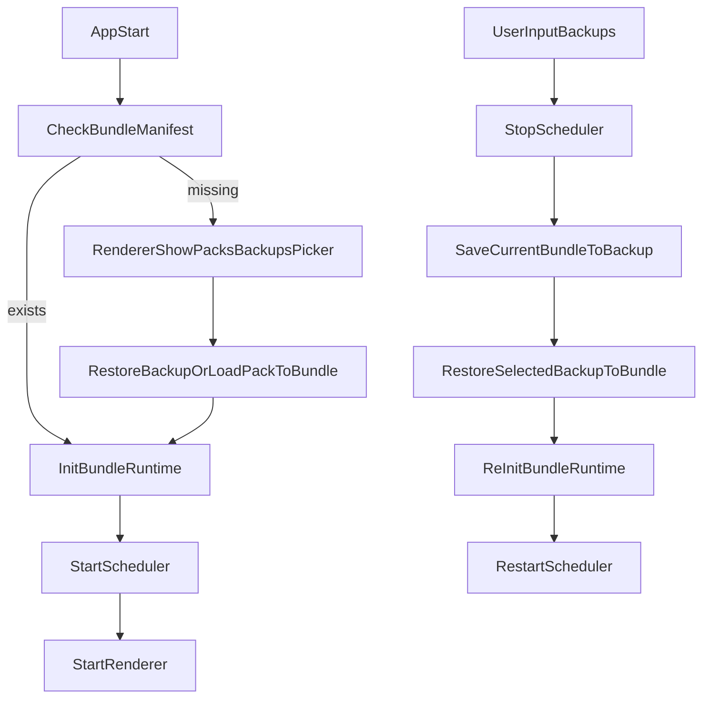

# Bundle/Pack/Backup 目录与职责方案

## 目标结论

- 启动主链路固定为：`选择/恢复 bundle -> init bundle runtime -> 启动 scheduler -> 启动 renderer`。
- 根级 `minecortex.json` 只保留全局默认（至少 `models`）；`renderer` 状态迁移到 `bundle/state/renderer.json`。
- **引入双态终端（Terminal）机制**：区分 Bundle 级的系统终端 (System Terminal, 负责环境安装) 和 Brain 级的用户终端 (User Terminal, 负责日常工作)。
- **全方位系统级沙盒**：默认 overlay 核心系统目录 (`/usr`, `/etc`, `/var`)，完美支持模型直觉性的 `sudo apt` 行为，且所有副作用严格收敛于 Bundle 存档内。

## 推荐目录结构（双态终端沙盒版）

消除“到处都是重复代码”并理清沙盒隔离边界的核心原则：

1. **依赖安装回归正统**：废除畸形的 `shared/lib` 拼接 `PATH`。环境安装直接由 System Terminal 落入覆盖在宿主机上的 `/usr/local` 等真实系统目录中。
2. **热更新 Overlay**：自定义挂载声明下沉到 `bundle/shared/sandbox/mounts.json`，运行时修改此文件即可触发终端热重启，动态新增挂载点。
3. **脑区私有化归于 `.home`**：废弃 `workspace` 概念，改为 `.home` 并挂载为 User Terminal 的 `$HOME`。

```text
minecortex/
├── minecortex.json                    # 全局默认配置（保留 models）
├── tools/                             # 【Global层】(系统级底层能力)
├── subscriptions/                     # 【Global层】
├── slots/                             # 【Global层】
│
├── packs/                             # 【模板库】(只读)
│   └── starter-pack/                  # 结构与 Bundle 配置层高度对称
│       ├── pack.json                  # 声明：所需环境 (如 ["python"])、自定义 overlays
│       ├── startup-scripts/           
│       │   └── setup.sh               # 包的自定义安装脚本 (由 System Terminal 执行)
│       ├── brains/                    # 预设的脑区模板
│       │   ├── coder/                 # (ConsciousBrain 示例)
│       │   │   ├── brain.json
│       │   │   ├── soul.md
│       │   │   ├── tools/             # Brain 级私有能力
│       │   │   └── slots/
│       │   └── planner/               # (ScriptBrain 示例)
│       │       ├── brain.json
│       │       └── src/               # 纯脚本脑的核心代码
│       ├── tools/                     # Pack/Bundle 级的预设能力
│       ├── subscriptions/             
│       ├── slots/                     
│       └── skills/                    # 自定义的扩展加载目录
│
├── backups/                           # 【存档库】(静态)
│   ├── starter-pack_1739482938.zip    # 将整个 bundle/ 剪切+打包 (必须包含 sandbox 以保留 apt 环境)
│   └── last-auto-save.zip
│
└── bundle/                            # 【唯一运行现场】(读写)
    ├── manifest.json                  # 记录 sourcePackId, 版本号, 生成时间
    ├── state/                         # UI 运行状态 (不进入版本控制)
    │   └── renderer.json              # activeBrain 等 UI 状态
    │
    ├── shared/                        # Bundle级共享区 (全脑区可见)
    │   ├── env/
    │   │   └── base.env               # 框架动态生成（运行注入）
    │   ├── sandbox/                   # [备份时必须保留!] 全量沙盒持久层
    │   │   ├── mounts.json            # 动态热更新的 overlay 声明配置
    │   │   └── overlays/              # 承接 sudo apt 和 setup.sh 的真实安装产物
    │   │       ├── sys_root/          # 默认挂载：拦截对 /usr, /etc, /var 的修改
    │   │       └── opt_conda/         # 自定义挂载：来源于 mounts.json 声明
    │   └── workspace/                 # 真正的跨脑协作共享工作区
    │
    ├── brains/                        # 本次运行的所有脑区 
    │   ├── coder/                     
    │   │   ├── brain.json             
    │   │   ├── soul.md                
    │   │   ├── tools/                 
    │   │   ├── .home/                 # [挂载为该脑的 $HOME] (替换原 workspace)
    │   │   ├── sessions/              # 对话历史
    │   │   ├── session.json           
    │   │   └── .tmp/                  # [不备份] 私有 /tmp 挂载点
    │   └── planner/
    │       ├── brain.json
    │       └── src/                   
    │
    ├── tools/                         # 【Bundle层能力】(三大核心)
    ├── subscriptions/                 
    ├── slots/                         
    └── skills/                        # 【Bundle层扩展能力】(自定义扩展)
```

## 初始化三步曲与生命周期 (Init 流程)

当用户从 Pack 创建一个新 Bundle 时，执行以下全新流程：

**Step 1: 准备 Bundle 级基础 (Init Bundle Environment)**

- 读取 `pack.json`，了解基建需求和自定义 overlays。
- 复制配置：将 Pack 的 `brains/`, `tools/` 等复制到 `bundle/`。将 overlays 声明写入 `bundle/shared/sandbox/mounts.json`。
- 将 `startup-scripts/` 临时复制到 `bundle/` 中。

**Step 2: 系统级终端执行安装 (System Terminal Setup)**

- 框架启动一个 **Bundle 级系统终端 (System Terminal)**。
  - 此终端享有最高层沙盒权限（映射为 `root`），默认对 `/usr/local`, `/etc`, `/var` 等系统核心目录开启 overlayfs 拦截（底层文件物理存在于 `shared/sandbox/overlays/<slug>/upper/`）。
- 框架执行内置的 Python 和 Node.js 基础环境安装（如果尚未安装）。
  - **断点续传**：安装完毕后，在 `manifest.json` 中标记 `pythonInstalled: true` 和 `nodeInstalled: true`。若中间断电，下次启动直接跳过已安装的步骤。
- 框架执行 `bundle/startup-scripts/setup.sh`。这完全是一个普通的 Shell 脚本，脚本里执行任何 `sudo apt-get install java` 或用 `wget` 下载 `python` 编译（如果内置的不满足需求），其产生的文件都会自动写入系统且被 `sandbox/overlays/` 持久化拦截。**此外，`setup.sh` 还负责输出系统级别的初始环境变量到 `bundle/shared/env/base.env` 中**。
- **环境固化与清理**：只有当 `setup.sh` 退出码为 `0` 后（即完全成功），才会标记 `manifest.json` 的 `setupScriptRan: true`，此时才可以安全地彻底删除 `bundle/startup-scripts/` 文件夹。若非 0（比如断网失败），`startup-scripts` 不会被删除，系统也会知道下次启动需要重新尝试执行该脚本。

**Step 3: 启动用户级终端 (User Terminal Boot)**

- Scheduler 启动。各个脑区（如 `coder`, `planner`）开始建立自己的 **脑区用户终端 (User Terminal)**。
- **继承环境**：这些终端作为普通用户，共享上一步构建的宏大系统环境（大家都能直接输入 `python` 或 `java`，因为系统路径里已经有了）。由 `setup.sh` 初始化生成的 `base.env` 作为底座环境变量。
- **私有隔离**：
  - 各自分别把 `bundle/brains/<id>/.home` 挂载为自己的 `$HOME`。AI 以为的 `~` 就是这。
  - 各个 Brain 目录下的 `.env` 会与 `base.env` 进行 Merge，形成该脑区特有的环境变量注入到终端中。（注：初始化时脑区的 `.env` 只是个空壳，由 AI 模型在后续运行中根据需要自行填写和修改）。
  - 挂载各自的 `.tmp` 为 `/tmp`。
- 大家可以在 `bundle/shared/workspace/` 里互相传文件协作。

## 备份与切换（`/backups`）

- **简单的剪切 + 打包逻辑**：
  - 触发备份时，停止 Scheduler。
  - 找到当前 `bundle/manifest.json` 里的包名，生成备份文件名（如 `starter-pack_1739482938.zip`）。
  - **备份整个 `bundle/` 目录**。
  - **唯一需要排除的**：只有 `brains/*/.tmp/`。
  - **必须包含**：`shared/sandbox/` 必须随存档打包！这里面有 AI 运行态以及 setup 装的所有软件环境（apt、python），丢失这部分存档即损坏。
  - 打包完后，清空当前的 `bundle/`。
- **切换恢复**：解压选中的 `backups/xxx.zip` 到 `bundle/` -> 若运行时触发了 `mounts.json` 热更新，终端管理器自动重启沙盒映射 -> 启动 Scheduler。

### 1. `packs/<packId>/pack.json`

Pack 的声明文件，也是从 Pack 创建 Bundle 的蓝图。包含你需要的高级**自定义 overlay 挂载声明**。
（注：框架不内置依赖安装器，所有的环境初始化逻辑完全交由 `startup-scripts/setup.sh` 自由发挥，框架只负责提供具有 Root 权限和持久化挂载的 System Terminal 沙盒环境）

```json
{
  "id": "minecraft-agent-pack",
  "name": "Minecraft AI Pack",
  "version": "1.0.0",
  "runtime": {
    "overlays": [
      {
        "target": "/opt/conda",
        "description": "用来安装 miniconda 的目录"
      },
      {
        "target": "/var/lib/mc-data",
        "description": "持久化游戏服务端数据"
      }
    ]
  }
}
```

*注：这些自定义 overlay 的 upper/work 目录会由框架在 `bundle/shared/sandbox/overlays/<slug>/` 下自动创建和管理。*

### 2. `bundle/manifest.json`

当前正在运行的 Bundle 的身份证。也是系统判断“当前是否有激活的 bundle”以及“初始化是否被意外中断”的绝对凭证。

```json
{
  "bundleId": "bnd_1739482938471",
  "source": {
    "type": "pack",             // "pack" 或 "backup"
    "id": "minecraft-agent-pack",
    "version": "1.0.0"
  },
  "runtimeState": {
    "setupScriptRan": true      // 标识是否已经成功跑完了 pack 的 setup.sh，防止断电导致环境半残
  },
  "createdAt": "2026-03-11T12:00:00Z",
  "lastStartedAt": "2026-03-11T14:30:00Z"
}
```

### 3. `bundle/state/renderer.json`

纯 UI/Renderer 运行态状态，不进入 backup（或即使备份也不影响逻辑）。脱离 `minecortex.json` 单飞。

```json
{
  "activeBrain": "coder",
  "lastOverlay": "sessions"
}
```

## 运行流程（含切换）




## 最小改造清单（不引入过多类，但确立顶层大管家）

- **新增顶层编排器** `src/bundle/manager.ts`：
  - 定义 `BundleManager` 单例（`getBundleManager()`）。
  - 核心职责：接管原 `Scheduler` 和 `TerminalManager` 里的环境初始化代码。负责 `loadPackToBundle()`, `saveCurrentBundleToBackup()`, `restoreBackupToBundle()`, 以及调用 System Terminal 跑 `setup.sh`。
- 迁移 renderer 状态：
  - 更新 `src/cli/renderer-config.ts` 将配置路径从根 `minecortex.json` 改为 `bundle/state/renderer.json`
- 保留 models default：
  - `src/core/scheduler.ts` 继续读根 `minecortex.json.models`
- 启动入口改造 `src/main.ts`：
  - 流程变更为：`new BundleManager().init() -> 检查 Manifest -> 若空则触发 Picker -> 若有则 new Scheduler().start() -> new CLIRenderer().start()`
- **沙盒与终端逻辑重构**：
  - `src/terminal/manager.ts`：废弃硬编码拼接，实现 System Terminal (Root态, 全局Overlay) 和 User Terminal (User态, .home挂载) 的双态模型。
- **重构 `PathManager`** (`src/fs/path-manager.ts`)：
  - `global()`：系统公共层（`tools/`, `packs/`, `backups/`）。
  - `bundle()`：纯粹的当前运行环境（`bundle/` 根目录及其内部的 `shared/`, `state/` 等）。
  - `local(brainId)`：精简为 `bundle/brains/<id>`，废弃 `workspace` 解析方法，默认解析相对路径时锁定在 `.home` 内。

## 关键迁移与兼容

- 首次迁移时，把根 `minecortex.json.renderer` 迁移到 `bundle/state/renderer.json`，迁移后删除根 `renderer` 字段。
- 为避免破坏老项目，保留一次性 fallback：若新文件不存在则读旧字段并自动搬迁。

