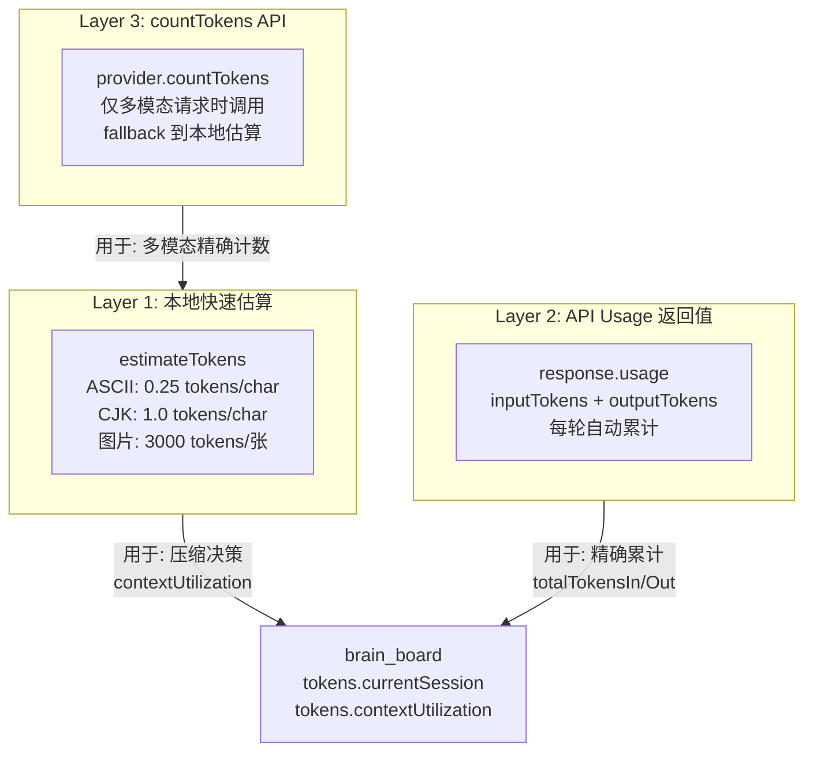
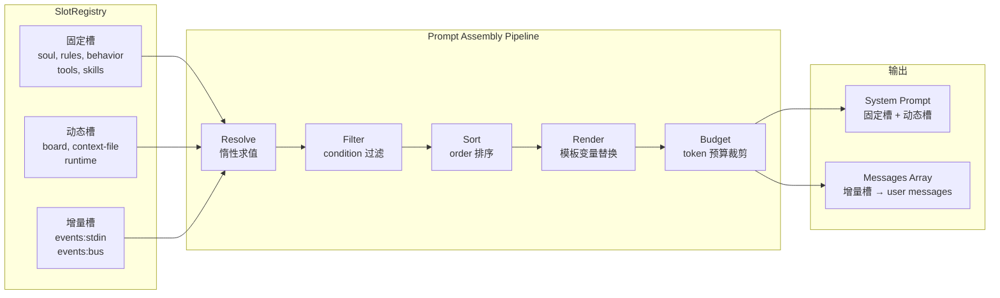
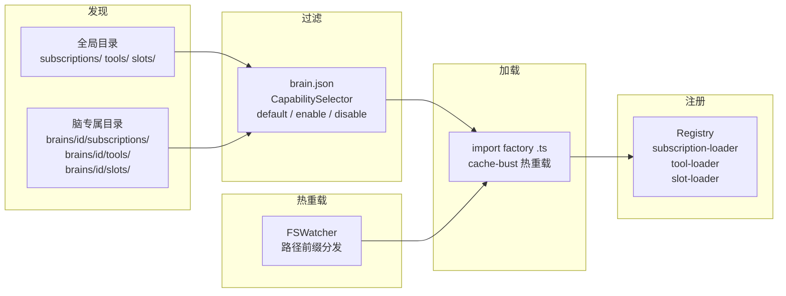
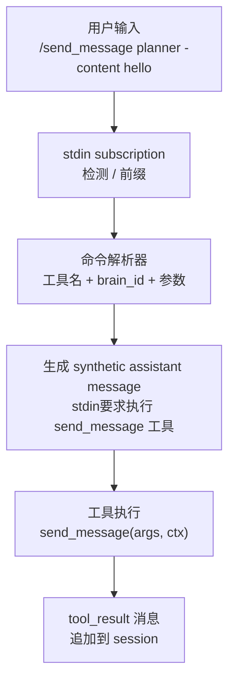
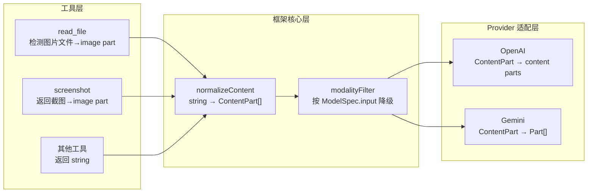
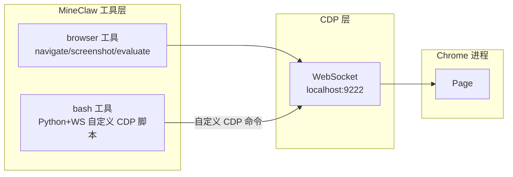
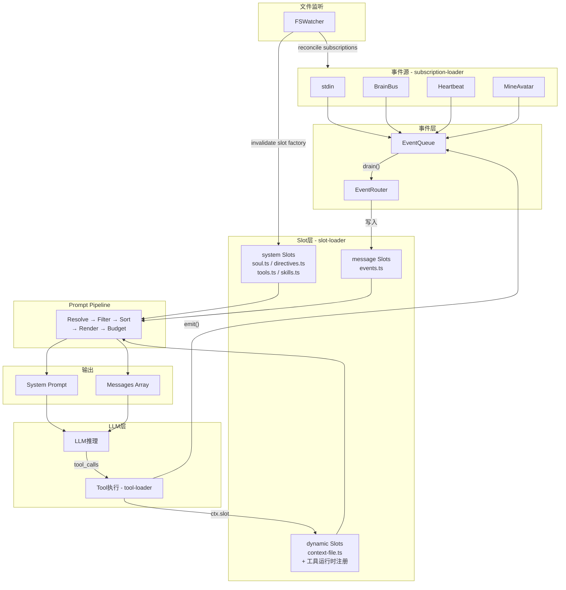

# MineClaw Roadmap 合理性分析与参考引用

## 一、参考框架全景

调研涵盖 `/home/aw/Desktop/gamer/references/` 下的六个框架：


| 框架                 | 核心定位                    | 对 MineClaw 的价值                                                                        |
| ------------------ | ----------------------- | ------------------------------------------------------------------------------------- |
| **agentic_os**     | 文件系统驱动的 Agent OS        | MineClaw 的主对标框架，Agent Loop / MessageBus / 分层 Prompt / 三层压缩 / Spawn Agent 均直接借鉴        |
| **agent_fcos**     | 行为树 + Agentic 框架        | Workspace Zone 路径设计 / Blackboard 脏数据追踪 / LLMDispatcher 上下文构建                          |
| **claude-code**    | Claude 的编码代理            | 110+ 模块化提示词组件 / Tool 描述最佳实践 / SubAgent(Task/Explore) / TodoWrite / Context Compaction |
| **cursor-prompts** | Cursor/VSCode Agent 提示词 | Agent 提示词结构化范式 / 工具描述模式 / 代码引用格式 / 简洁性约束                                              |
| **gemini-cli**     | Google Gemini CLI Agent | 可组合提示词架构 / Sub-agent 委托策略 / Plan Mode / 上下文优先级层次 / Core Mandates                      |
| **manus**          | Manus 全能 Agent          | 事件驱动 Loop / Planner-Knowledge-Datasource 三模块 / todo.md 任务管理                           |


---

## 二、Roadmap 路线合理性评估

### 总体评价：路线高度合理

MineClaw roadmap 的设计与业界顶级 Agent 框架高度对齐，核心架构决策（Slot+Tool 两原语、多脑自治、文件即状态）既独特又务实。以下逐模块分析：

### 2.1 合理且紧急的模块

**SS7 删除 state.json + SS8 通用工具补全** -- 正确决策

- agentic_os 的 state 管理分散在 session/memory/task-board 中，MineClaw 将其统一为动态 Slot(工具临时注入) + brain_board(公开动态注册表) 更清晰
- 工具集(read_file/write_file/edit_file/glob/grep/bash)完全对齐 agentic_os + claude-code 的标配
- brain-aware 路径解析是 agent_fcos Zone 模式的更优简化

**SS0 fs-watcher + SS4 ContextSlot 化** -- 核心基础设施

- claude-code 用 110+ 模块化组件组装提示词，Gemini CLI 用 TypeScript 函数组合 -- 都验证了"Slot 化"方向
- Slot 的惰性求值 + invalidate 与 agent_fcos 的 WorkTracker 脏数据追踪思路一致
- fs-watcher 是 Slot 懒加载的前提

### 2.2 合理但可优化的模块

**SS1 Session 管理** -- 三层压缩对齐业界最佳实践

- agentic_os 的三层压缩(micro-compact / auto-compact / manual-compact)与 MineClaw 设计完全一致
- claude-code 的 context compaction 用结构化摘要(Task Overview / Current State / Discoveries / Next Steps)
- 建议：摘要结构参考 claude-code 的格式，比纯文本摘要更利于 LLM 恢复上下文

**SS5 Skills 系统** -- 两层加载对齐 agentic_os

- agentic_os 的 skills/loader.ts 实现了完全相同的两层模式
- Gemini CLI 的 AgentSkills 变量注入模式可参考

### 2.3 独创且有价值的模块

**SS6 ScriptBrain** -- 独创设计，无直接对标

- agent_fcos 的 BT 节点最接近(非 LLM 驱动的算法节点)，但 MineClaw 的 ScriptBrain 更统一
- 建议：考虑从 agent_fcos 借鉴 RUNNING 作为一等公民的概念 -- ScriptBrain 的 update() 可返回 RUNNING 状态

**SS2 工具发消息与触发** -- 工具直接 emit，不走订阅

- 工具通过 `ctx.emit()` 直接发事件/做触发，不需要经过 subscription 系统
- spawn_thought 支持 foreground + background 双模式，三种类型 observe/plan/act（Minecraft 游戏 agent 语义），匿名 agent 继承父 brain 的资源，退出时总结消息发给调用者
- MineClaw 的 `priority` + `silent` 双维度控制比 agentic_os 的固定类型更通用

**SS3 动态订阅** -- brain.json 统一管理 + manage_subscription 原子工具

- brain.json 是所有订阅的单一真相源（外部全局 + 内部脑专属）
- 三个独立工具（`subscribe` / `unsubscribe` / `list_subscriptions`）替代单一 manage_subscription，单一职责更清晰，LLM 永远不直接编辑 brain.json
- 新增订阅类型 = 两步：write_file 创建源码 + subscribe enable
- fs-watcher 检测 brain.json 变更 → subscription-loader diff 新旧配置 → 启停差异项
- 参考 openclaw 的 config-reload.ts：debounce + diffConfigPaths + buildReloadPlan

---

## 三、各模块实现路径与参考引用

### 3.1 SS7 删除 state.json -- brain_board 动态注册表 + 工具级动态 Slot + Token 统计

**实现路径**：

1. 删除 `brain.ts` 的 `updateState()` + `context-engine.ts` Layer 2
2. 实现 `brain_board` -- Scheduler 维护 `Map<brainId, Map<string, unknown>>` 动态注册表
3. 实现工具级动态 Slot API（`ctx.slot.register/update/release`）
4. 实现 token 统计系统（见下方详述）

**brain_board — 动态可扩展状态注册表**：

`brain_board` 是每个脑对外暴露的公开状态面板。**不采用硬编码 interface**，而是 `Map<string, unknown>` 动态注册表——框架、subscription、工具、LLM 均可注册/更新/移除字段：

```typescript
// brain_board 是动态 Map，无固定 schema
type BrainBoard = Map<string, unknown>;

// 注册 API（Scheduler 维护，多方写入）
interface BrainBoardAPI {
  set(brainId: string, key: string, value: unknown): void;
  get(brainId: string, key: string): unknown;
  remove(brainId: string, key: string): void;
  getAll(brainId: string): Record<string, unknown>;
}
```

**谁写入什么**（全部通过注册 API，无硬编码字段）：

| 写入者 | 注册的 key 示例 | 说明 |
|--------|---------------|------|
| 框架（brain.ts） | `status`, `currentTurn`, `lastActivity` | 框架在 process() 中自动注册基础运营字段 |
| Token subscription | `tokens.currentSession`, `tokens.contextUtilization` | subscription 监听 session 变化，计算并注册 token 统计 |
| spawn_thought 工具 | `thought:t1` | 匿名 agent 运行时临时注册，free 后移除 |
| LLM 通过工具 | `currentPlan`, `currentPhase` | 脑自己通过工具向外展示状态 |

**访问方式**：其他脑通过 `manage_brain({ action: "list" })` 查询任意脑的完整 brain_board。

**Subscription 访问 brain_board**：EventSourceFactory 的 context 中包含 `brainBoard: BrainBoardAPI`，subscription 可以读写当前脑的 board 字段（如 token monitor subscription 写入 `tokens.*`）。

**设计优势**：
- 不存在"框架预定义了哪些字段"的耦合——一切都是运行时注册的
- 新增监控维度 = 新增一个 subscription（如 `token-monitor.ts`），框架代码不变
- 脑自己决定向外界展示什么状态，通过工具调用 board API

#### Token 统计方案

> 调研结论：agentic_os 用 `text.length * tokensPerChar` 本地估算 + API usage 累计，
> gemini-cli 用 `ASCII 0.25 + CJK 1.3 + 图片 3000` 混合估算 + countTokens API（仅多模态时）。
> 所有框架都**优先使用 API 返回值**，本地估算仅用于压缩决策和 fallback。

**MineClaw 三层 token 统计**：



**各层用途**：

| 层 | 何时用 | 准确度 | 性能 | 参考 |
|---|---|---|---|---|
| 本地估算 | 每轮 turn 前，判断是否触发压缩 | ±20% | 零开销 | agentic_os `estimateTokensForModel` |
| API Usage | 每轮 turn 后，从 LLM 响应中提取 | 100% | 零额外开销 | agentic_os `response.usage` |
| countTokens | 包含图片/文件的请求（可选） | 100% | 额外 API 调用 | gemini-cli `countTokens` |

**本地估算系数**（和 `ModelSpec.tokensPerChar` 联动）：

```typescript
function estimateTokens(content: string | ContentPart[], spec: ModelSpec): number {
  if (typeof content === "string") {
    return Math.ceil(content.length * spec.tokensPerChar);
  }
  let total = 0;
  for (const part of content) {
    if (part.type === "text") total += Math.ceil(part.text.length * spec.tokensPerChar);
    if (part.type === "image") total += 3000;  // 固定估算（参考 gemini-cli）
  }
  return total;
}
```

**API Usage 累计**（每轮 turn 自动更新）：

```typescript
// brain.ts process() 中
const response = await provider.chat(messages, tools);
if (response.usage) {
  this.stats.tokens.lastInputTokens = response.usage.inputTokens;
  this.stats.tokens.lastOutputTokens = response.usage.outputTokens;
  this.stats.tokens.totalTokensIn += response.usage.inputTokens;
  this.stats.tokens.totalTokensOut += response.usage.outputTokens;
}
// 更新 brain_board
this.stats.tokens.currentSession = estimateTokens(messages, spec);
this.stats.tokens.contextUtilization = this.stats.tokens.currentSession / spec.contextWindow;
```

**参考提示词/代码**：

- agentic_os 的 `<running_agents>` 注入模式：`[references/agentic_os/src/factory.ts](references/agentic_os/src/factory.ts)` L347-387 -- `getSystemPrompt()` 动态注入运行中 agent 列表
- agentic_os TaskBoard：`[references/agentic_os/src/session/task-board.ts](references/agentic_os/src/session/task-board.ts)` -- 自动生成 markdown 格式活动追踪
- claude-code TodoWrite 提示词：`[references/claude-code-system-prompts/](references/claude-code-system-prompts/)` 中 TodoWrite 工具描述(2167 tokens)展示了任务状态管理的最佳范式
- **agentic_os token 估算**：`[references/agentic_os/src/llm/models.ts](references/agentic_os/src/llm/models.ts)` — `estimateTokensForModel(text, model)` + `ModelSpec.tokensPerChar`
- **agentic_os usage 累计**：`[references/agentic_os/src/agent-session.ts](references/agentic_os/src/agent-session.ts)` — `totalTokensIn/Out` session 级持久化
- **gemini-cli 混合估算**：`[references/gemini-cli/packages/core/src/utils/tokenCalculation.ts](references/gemini-cli/packages/core/src/utils/tokenCalculation.ts)` — ASCII 0.25 + CJK 1.3 + 图片 3000 + countTokens API fallback

### 3.2 SS8 通用工具补全

**实现路径**：

1. 实现 `src/tools/resolve-path.ts` -- brain-aware 路径解析
2. 文件工具(read_file/write_file/edit_file/glob/grep/bash)复用 agentic_os 实现
3. manage_brain 工具
4. spawn_thought 工具(依赖 SS2)

**参考提示词/代码**：

**工具描述范式** -- 每个工具描述应包含：

- 用途 + 何时使用 + 何时不使用 + 参数说明 + 示例

参考 claude-code 的工具描述模式：

```
- ReadFile: 469 tokens, 含"何时使用"、参数约束、截断警告
- Task: 1331 tokens, 含子agent类型、并行/串行指导
- Bash: 30+ 模块化组件, 含安全约束、命令描述要求
```

核心参考文件：

- **agentic_os 工具实现**：`[references/agentic_os/src/tools/](references/agentic_os/src/tools/)` -- read-file.ts / write-file.ts / edit-file.ts / bash.ts / glob.ts / grep.ts 可直接适配
- **agent_fcos Zone 路径**：`[references/agent_fcos/docs/11_runtime/workspace.md](references/agent_fcos/docs/11_runtime/workspace.md)` -- `[workspace:]zone/path` 格式设计
- **claude-code 工具描述**：`[references/claude-code-system-prompts/](references/claude-code-system-prompts/)` -- 工具描述结构化范式
- **cursor agent 提示词**：`[references/cursor-prompt-stash/Cursor/cursor-agent-claude-3.7-sonnet.txt](references/cursor-prompt-stash/Cursor/cursor-agent-claude-3.7-sonnet.txt)` -- tool_calling 和 making_code_changes 部分展示了工具使用规则的最佳写法

**bash 工具安全约束**参考 claude-code 模式：

- Sandbox 模式默认启用
- 禁止用 bash 做文件操作(用专用工具)
- 命令描述要求
- 工作目录持久化

### 3.3 SS0 fs-watcher

**实现路径**：

1. 一个 `node:fs/watch(ROOT, { recursive: true })` 监听整个 mineclaw 工作目录
2. 封装为 FSWatcher 类 — 内部做路径前缀匹配 + 防抖(300ms 默认)
3. Scheduler 创建单一 Watcher 实例 + 注册路径模式 handler
4. 各 Loader 暴露 invalidate() / reconcile() / reload()

**路径分发表**（单一 watcher，路径前缀匹配分发）：


| 路径模式                             | 触发行为                                                           | 对应 Loader                         |
| -------------------------------- | -------------------------------------------------------------- | --------------------------------- |
| `brains/<id>/brain.json`         | subscription-loader reconcile（启停订阅差异项） + slot-loader reconcile | subscription-loader / slot-loader |
| `brains/<id>/subscriptions/*.ts` | 热重载该脑专属订阅源（stop → reimport → start）                            | subscription-loader               |
| `subscriptions/*.ts`             | 热重载全局订阅源（影响所有引用该源的脑）                                           | subscription-loader               |
| `brains/<id>/slots/*.ts`         | 热重载该脑专属 Slot factory（reimport → re-register）                   | slot-loader                       |
| `slots/*.ts`                     | 热重载全局 Slot factory                                             | slot-loader                       |
| `brains/<id>/directives/*.md`    | slot:directives.ts 重新扫描 → 更新 Slot content                      | slot-loader（间接）                   |
| `directives/*.md`                | slot:directives.ts 重新扫描 → 更新全局 directive Slot                  | slot-loader（间接）                   |
| `brains/<id>/soul.md`            | slot:soul.ts invalidate → 重读 content                           | slot-loader（间接）                   |
| `brains/<id>/tools/*.ts`         | 热重载工具（SS8）                                                     | tool-loader                       |
| `tools/*.ts`                     | 热重载全局工具                                                        | tool-loader                       |
| `brains/<id>/skills/`            | slot:skills.ts 重新扫描 → 更新摘要                                     | slot-loader（间接）                   |
| `skills/`                        | slot:skills.ts 重新扫描 → 更新全局 Skills 摘要                           | slot-loader（间接）                   |


**订阅** `.ts` **文件热重载要点**：

ESM `import()` 有模块缓存，同一路径第二次 import 返回缓存。用 query string cache-busting 解决：

```typescript
const mod = await import(`${absolutePath}?t=${Date.now()}`);
```

热重载流程：stop 旧 source → cache-bust reimport → factory 创建新 source → start 新 source

**订阅错误保护**：

- `source.start()` 包 try-catch，失败时 emit `{ source: "system", type: "subscription_error" }` 事件到对应脑
- emit 回调包 wrapper 防止运行时异常扩散
- 脑自己可感知错误事件，是否自修复取决于其 soul/skills/directives 配置

**参考代码**：

- agentic_os 没有显式 fs-watcher，但其 `context-files.ts` 的 JIT 扫描模式可参考
- agent_fcos 的 WorkTracker 脏数据追踪：`[references/agent_fcos/pkg/builtin_nodes/agentic/](references/agent_fcos/pkg/builtin_nodes/agentic/)` -- 版本号基于变更追踪，只在脏时重新加载
- openclaw config-reload.ts 的 debounce + diff + reloadPlan 模式可复用于订阅热重载

### 3.4 SS4 ContextSlot 化

#### Slot 类型体系

```typescript
interface ContextSlot {
  id: string;                 // "soul", "rules", "board", "events:stdin"
  kind: SlotKind;             // 决定注入位置和渲染方式
  order: number;              // Pipeline 排序（小 = 靠前）
  priority: number;           // Budget 裁剪优先级（高 = 保留）
  condition?: () => boolean;  // 条件渲染（false 则跳过）
  content: string | (() => string);  // 静态文本 或 惰性求值函数
  version: number;            // 脏标记（变更时递增）
}

type SlotKind =
  | 'system'     // 固定槽 → 注入 system prompt（soul, rules, behavior, tools, skills）
  | 'dynamic'    // 动态槽 → 注入 system prompt，内容由运行时决定（board, context-file, focus）
  | 'message';   // 增量槽 → 注入 messages 数组（events:stdin, events:bus, events:heartbeat）
```

#### Slot 文件化 — 统一 factory 模式

Slot 和 Subscription 完全对称：文件发现 + CapabilitySelector + factory。

**目录结构**：

```
slots/                          ← 全局 Slot factory
  soul.ts                       ← 读 soul.md → 1 个固定槽
  directives.ts                 ← 扫描 directives/*.md → N 个固定槽（动态扩展）
  tools.ts                      ← 工具定义 → 1 个固定槽
  skills.ts                     ← Skills 摘要 → 1 个固定槽
  (动态 Slot 由工具运行时注册，无需 factory 文件)
  context-file.ts               ← focus 目录 AGENTS.md → 1 个动态槽
  events.ts                     ← 事件类型 → N 个增量槽

brains/<id>/slots/              ← 脑专属（同名覆盖全局）
  world-snapshot.ts             ← 自定义动态槽
  directives.ts                 ← 可覆盖全局版本
```

**brain.json slots 配置**（和 subscriptions 语义一致）：

```json
{
  "slots": {
    "default": "all",
    "disable": ["world-snapshot"],
    "config": { "board": { "showCompleted": false } }
  }
}
```

**SlotFactory 接口**（对标 EventSourceFactory）：

```typescript
export interface SlotContext {
  brainId: string;
  brainDir: string;
  config?: Record<string, unknown>;
  brainBoard: BrainBoardAPI;
}

export type SlotFactory = (ctx: SlotContext) => ContextSlot | ContextSlot[];
```

factory 返回单个或数组 — `directives.ts` 扫描目录后返回 N 个子 Slot。

**内置 Slot factory 一览**：


| Factory           | 发现什么                                              | 注册什么        | kind    |
| ----------------- | ------------------------------------------------- | ----------- | ------- |
| `soul.ts`         | `brains/<id>/soul.md`                             | 1 个槽        | system  |
| `directives.ts`   | `directives/*.md` + `brains/<id>/directives/*.md` | N 个槽        | system  |
| `tools.ts`        | 工具定义列表                                            | 1 个槽        | system  |
| `skills.ts`       | `skills/` + `brains/<id>/skills/`                 | 1 个槽        | system  |
| _(动态 Slot)_     | 工具运行时注册（无需 factory）                       | N 个临时槽     | dynamic |
| `context-file.ts` | focus 目录 AGENTS.md                                | 1 个槽        | dynamic |
| `events.ts`       | 事件源类型                                             | N 个槽        | message |


**没有独立的 directive-loader / skill-loader** — 一切都是 Slot factory，统一走 `slot-loader.ts`。

**directives.ts 示例**（动态扩展为 N 个 Slot）：

```typescript
const create: SlotFactory = (ctx) => {
  const files = scanAndMerge(join(ROOT, 'directives'), join(ctx.brainDir, 'directives'));
  return files.map((file, i) => ({
    id: `directive:${file.name}`,
    kind: 'system' as const,
    order: 20 + i,
    priority: 9,
    content: () => readFileSync(file.path, 'utf-8'),
    version: 0,
  }));
};
```

#### 三类 Slot kind


| kind      | 注入位置                                    | 典型 factory                      |
| --------- | --------------------------------------- | ------------------------------- |
| `system`  | system prompt（固定，fs-watcher 更新 content） | soul, directives, tools, skills |
| `dynamic` | system prompt（工具/事件驱动增删改）               | board, context-file             |
| `message` | messages 数组（EventRouter 每 turn 写入）      | events                          |


#### 工具级动态 Slot 注册机制

**泛化设计**：不再有专名 "slot_board"。任何工具都可以通过 `ctx.slot` API 动态注册/更新/释放临时 Slot。空 Slot（已释放或内容为空）不渲染，零 token 开销。

```typescript
// ToolContext 的动态 Slot API
interface ToolContext {
  brainId: string;
  emit: (event: Event) => void;
  signal: AbortSignal;
  brainBoard: BrainBoardAPI;
  slot: {
    register(id: string, content: string, opts?: { order?: number; priority?: number }): void;
    update(id: string, content: string): void;
    release(id: string): void;
    get(id: string): string | undefined;
  };
}
```

**生命周期**：
- **Foreground 工具**：Slot 在工具 return 后可选自动释放（默认释放），或保留供后续 turn 使用
- **Background 工具**（如 spawn_thought）：Slot 在工具 return 后继续存在，异步完成后显式 `release`
- **空 Slot**：Pipeline 渲染时 `condition()` 检查内容是否为空，空则跳过

**每个动态 Slot 都是独立的 `dynamic` kind Slot**——注册时自动创建、释放时自动删除。不需要"一个大 board Slot 内含 entries"的模式。

**使用示例**：

```typescript
// spawn_thought 注册运行状态 Slot
ctx.slot.register("thought:t1", "▶ observe: 侦察北方地形 (32s)");
// 后台完成后释放
ctx.slot.release("thought:t1");

// todo_write 工具注册 todo 列表 Slot
ctx.slot.register("todos", renderTodos(items), { order: 60, priority: 8 });
// 更新
ctx.slot.update("todos", renderTodos(updatedItems));

// 自定义工具注册临时上下文
ctx.slot.register("analysis:result", analysisContent);
// 工具返回后自动释放
```

**spawn_thought + Todo 联动流程**：

```
① LLM → todo_write([{ id: "research", content: "Research auth", status: "in_progress" }])
   → ctx.slot.register("todos", renderTodos(items))

② LLM → spawn_thought({ task: "Research auth patterns", type: "observe" })
   → ctx.slot.register("thought:t1", "▶ observe: Research auth patterns")
   → 工具立即返回 { thoughtId: "t1", status: "launched" }

③ 后台 thought 完成：
   → ctx.slot.release("thought:t1")
   → ctx.slot.update("todos", renderTodos(updatedItems))  // research → completed
   → emit({ source: "tool:spawn_thought", type: "thought_result", payload: result, priority: 0 })
   → EventQueue 唤醒 → LLM 下一轮 drain() 拿到结果

④ LLM 处理 thought_result → 看到 todos 中 research 已完成 → 继续下一个任务
```

**设计优势**：
- 不存在"slot_board"的特殊概念——工具级别的动态 Slot 是通用机制
- 任何工具都可以临时向 system prompt 注入信息（如分析结果、进度追踪、待办列表）
- Slot 释放后完全消失，不留占位

#### Prompt Assembly Pipeline

Slot 的最终输出由 Pipeline 组装。Pipeline 是 SS4 的核心，统一了三种范式：




**Pipeline 各阶段**：


| 阶段          | 作用                                        | 参考                                      |
| ----------- | ----------------------------------------- | --------------------------------------- |
| **Resolve** | 求值 `content`：string 直接用，函数调用取值            | agent_fcos WorkTracker 惰性求值             |
| **Filter**  | `condition()` 为 false 的 Slot 跳过（如空 board） | agentic_os 条件指令                         |
| **Sort**    | 按 `order` 排序决定渲染顺序                        | agentic_os directive order              |
| **Render**  | 模板变量 `${VAR}` 替换                          | agentic_os PromptAssembler + gemini-cli |
| **Budget**  | token 总量超预算时，按 `priority` 从低到高裁剪          | MineClaw 独创                             |


**Budget 裁剪优先级**（高 = 保留）：


| priority | Slot 类型         | 裁剪策略          |
| -------- | --------------- | ------------- |
| 10       | soul            | 永不裁剪          |
| 9        | rules, behavior | 永不裁剪          |
| 8        | board, tools    | 很少裁剪          |
| 7        | skills          | 超预算时截断为摘要     |
| 5        | context-file    | 超预算时截断（头 + 尾） |
| 3        | runtime         | 超预算时移除        |


**增量槽（message kind）不参与 Budget**——它们直接映射为 messages 数组中的 user 消息，由 Session 层的压缩机制管理。

#### 三 Loader 对称设计

MineClaw 的三大可扩展资源（Subscription / Tool / Slot）采用完全对称的 Loader 模式：




| 维度           | subscription-loader          | tool-loader            | slot-loader                           |
| ------------ | ---------------------------- | ---------------------- | ------------------------------------- |
| 全局目录         | `subscriptions/`             | `tools/`               | `slots/`                              |
| 脑专属          | `brains/<id>/subscriptions/` | `brains/<id>/tools/`   | `brains/<id>/slots/`                  |
| 同名覆盖         | 内部 > 外部                      | 内部 > 外部                | 内部 > 外部                               |
| brain.json 键 | `subscriptions`              | `tools`                | `slots`                               |
| Factory 类型   | `EventSourceFactory`         | `ToolFactory`          | `SlotFactory`                         |
| Factory 返回   | `EventSource`                | `Tool`                 | `ContextSlot / ContextSlot[]`         |
| 注册表          | source registry              | tool registry          | `SlotRegistry`                        |
| 热重载          | stop → reimport → start      | reimport → re-register | reimport → re-register                |
| 间接加载         | --                           | --                     | directives/*.md, skills/*.md, soul.md |


**核心差异**：slot-loader 的 factory 可间接加载非 `.ts` 文件（如 `directives.ts` 扫描 `directives/*.md`），这让 directives/skills/soul 无需独立 loader。

**通用基础设施建议**（SS0 时实现）：

```typescript
abstract class BaseLoader<TFactory, TInstance> {
  protected abstract importFactory(path: string): Promise<TFactory>;
  protected abstract createInstance(factory: TFactory, ctx: unknown): TInstance;
  protected abstract register(name: string, instance: TInstance): void;
  protected abstract unregister(name: string): void;

  discover(globalDir: string, localDir: string): Map<string, string>;
  filterByCapability(names: Map<string, string>, selector: CapabilitySelector): string[];
  async loadAll(paths: string[], ctx: unknown): void;
  async reload(name: string, path: string, ctx: unknown): void;
}
```

#### 实现路径

1. 类型定义：`ContextSlot` / `SlotKind` / `SlotRegistry` / `SlotFactory` / `SlotContext` 接口
2. `BaseLoader` 通用基类（SS0 阶段实现，三个 loader 复用）
3. `slot-loader.ts`：继承 BaseLoader，实现 SlotFactory 的发现-过滤-加载-注册
4. SlotRegistry 类：`register()` / `update()` / `remove()` / `get()` + `renderSystem()` / `renderMessages()`
5. 动态 Slot API：`ctx.slot.register()` / `update()` / `release()` — 工具临时注入 system prompt
6. Event Router：事件 → 增量槽的桥梁（按 source 路由到对应的 message Slot）
7. Prompt Pipeline：Resolve → Filter → Sort → Render → Budget
8. 迁移 context-engine.ts 到 Pipeline 渲染
9. focus 工具驱动的 context-file Slot 替换

**参考代码**：

- **agentic_os `<running_agents>` 动态注入**：`[references/agentic_os/src/factory.ts](references/agentic_os/src/factory.ts)` L366-384 — 每次 getSystemPrompt() 动态构建运行中 agent 列表
- **agentic_os AgentRegistry**：`[references/agentic_os/src/core/agent-registry.ts](references/agentic_os/src/core/agent-registry.ts)` — register / appendOutput / finish 生命周期
- **agentic_os TaskBoard**：`[references/agentic_os/src/session/task-board.ts](references/agentic_os/src/session/task-board.ts)` — addTask / updateProgress / complete
- **claude-code TodoWrite + System Reminder**：todo 状态变更时注入 `system-reminder-todo-list-changed.md`
- **agent_fcos Context Builder**：`[references/agent_fcos/pkg/builtin_nodes/agentic/context_builder.go](references/agent_fcos/pkg/builtin_nodes/agentic/context_builder.go)` — 脏数据追踪，只包含变更内容

### 3.5 SS1 Session 管理

**实现路径**：

1. JSONL 持久化(每脑独立 sessions/ 目录)
2. **多模态内容持久化策略**（见下方详述）
3. 微压缩(旧 tool_result 替换为占位符，含多模态清理)
4. 自动压缩(token 超阈值时 LLM 摘要)
5. `compact` 工具 — 手动触发上下文压缩
6. 压缩阈值与 `models.json` contextWindow 联动

#### 多模态内容持久化策略

`ContentPart` 在 session 持久化时需要区分存储方式，避免 JSONL 文件膨胀：

**存储规则**（按媒体大小分级）：

```
小媒体（< INLINE_THRESHOLD）     → base64 内联存入 JSONL
大媒体（>= INLINE_THRESHOLD）    → 保存到 medias/ 目录，JSONL 存路径引用
网络媒体（URL 来源）              → 下载到 medias/ 目录，JSONL 存本地路径引用
```

`INLINE_THRESHOLD` 建议默认 **50KB**（base64 后约 67KB，一行 JSONL 可接受）。

**Session 目录结构**：

```
brains/<id>/
├── session.json             ← 当前活跃 session 指针
│   { "currentSessionId": "s_1709123456" }
└── sessions/
    └── <sid>/
        ├── messages.jsonl   ← session 消息（文本 + 小媒体内联 + 大媒体引用）
        ├── qa.md            ← 人可读问答记录
        └── medias/          ← 大媒体文件存储
            ├── t3_screenshot.png
            ├── t5_game_view.png
            └── t8_web_image.jpg
```

**`session.json` — 活跃 session 指针**：

框架启动时读取 `session.json` 获取当前 session ID，resume 该 session。如果文件不存在或 session 目录已损坏，自动创建新 session。自动压缩归档时 `session.json` 不变（仍指向同一 sid，messages.jsonl 被替换为摘要版本）。

**JSONL 中的多模态格式**：

```jsonl
// 小图片 — base64 内联
{"role":"tool","content":[{"type":"text","text":"当前画面"},{"type":"image","data":"iVBOR...","mimeType":"image/png"}],"toolCallId":"tc_1","ts":1709...}

// 大图片 — 路径引用
{"role":"tool","content":[{"type":"text","text":"游戏截图"},{"type":"image_ref","path":"medias/t3_screenshot.png","mimeType":"image/png"}],"toolCallId":"tc_2","ts":1709...}
```

**Session Resume 时的加载逻辑**：

```typescript
function loadContentPart(part: SerializedPart): ContentPart {
  if (part.type === "text") return part;
  if (part.type === "image") return part;  // 内联 base64，直接用
  if (part.type === "image_ref") {
    // 路径引用：检查文件是否存在
    if (fs.existsSync(resolve(sessionDir, part.path))) {
      const data = fs.readFileSync(resolve(sessionDir, part.path), "base64");
      return { type: "image", data, mimeType: part.mimeType };
    }
    // 文件丢失：降级为文本占位符
    return { type: "text", text: `[Image: ${part.path} — 原文件已丢失]` };
  }
}
```

**类型定义**：

```typescript
// 运行时类型（内存中 / 发给 LLM）
export type ContentPart =
  | { type: "text"; text: string }
  | { type: "image"; data: string; mimeType: string };

// 持久化类型（JSONL 中）— 新增 image_ref
export type SerializedPart =
  | { type: "text"; text: string }
  | { type: "image"; data: string; mimeType: string }           // 小图片内联
  | { type: "image_ref"; path: string; mimeType: string };      // 大图片引用
```

#### brain.json session 配置

```json
{
  "session": {
    "keepToolResults": 5,
    "keepMedias": -1
  }
}
```

| 字段 | 默认值 | 说明 |
|------|-------|------|
| `keepToolResults` | `5` | 保留最近 N 个 tool_result 原样，更早的替换为占位符。当前 turn 内的 tool_result 不计入（始终保留） |
| `keepMedias` | `-1` | 保留最近 N 个含 image/image_ref 的消息的媒体文件。`-1` = 无限保留（不自动删除 medias/） |

不配置 `session` 键时使用上述默认值。

#### 三层压缩策略（参考 agentic_os 并增强）

**Layer 1: 微压缩（micro-compact）**— 每轮 turn 后自动执行

- **工具结果压缩**：当前 turn 外的 tool_result，保留最近 `keepToolResults`（默认 5）个原样，更早的替换为 `[Previous: used {toolName}]`
- **多模态保留**：保留最近 `keepMedias` 个含媒体的消息的 image/image_ref 数据。超出的媒体引用替换为文本占位符 `[Image: filename — 已清理]`，对应 `medias/` 文件删除（释放磁盘）。`keepMedias = -1` 时不删除任何媒体
- 当前 turn 内产生的 tool_result 和媒体始终保留，不参与微压缩计数
- 参考 agentic_os 的微压缩，但增加了多模态清理和可配置性

**Layer 2: 自动压缩（auto-compact）**— token 超阈值时触发

- LLM 生成结构化摘要替换全部历史（纯文本，无图片）
- 原始 messages.jsonl 归档为 `messages.jsonl.{timestamp}.bak`
- medias/ 目录可选归档或清理
- 摘要格式参考 claude-code：

```
<summary>
## Task Overview: ...
## Current State: ...
## Key Discoveries: ...
## Next Steps: ...
## Context to Preserve: ...
</summary>
```

**Layer 3: 手动压缩（compact 工具）**— 脑主动调用

```
compact()
→ 手动触发当前 session 的压缩
→ 使用 claude-code 风格结构化摘要
→ 返回 { tokensBefore, tokensAfter, summaryTokens }
```

适用场景：脑感知到上下文过长时主动压缩，不需要等自动触发。

#### contextWindow 联动

> 调研结论：**无框架采用暴力硬截断**。agentic_os 用 LLM 摘要替换全部消息（原始保存到 transcript），
> openclaw 用智能分块丢弃 + `repairToolUseResultPairing` 修复 tool 配对，
> claude-code 大输出保存到磁盘用文件引用。MineClaw 采用组合策略。

自动压缩阈值根据当前脑的 model 动态计算：

```typescript
const spec = getModelSpec(brain.model);
const compactThreshold = Math.floor(spec.contextWindow * 0.6);  // 60% 触发自动压缩
```

**不使用硬截断**。当 auto-compact 后仍超限（极端情况），采用 openclaw 式智能裁剪：

```typescript
// 自动压缩策略（替代暴力截断）
if (estimateTokens(messages) > compactThreshold) {
  // 1. 将消息分为旧区（~70%）和新区（~30%）
  const splitPoint = findSplitPoint(messages, 0.7);
  
  // 2. 旧区 → LLM 结构化摘要（参考 claude-code 格式）
  const summary = await generateSummary(messages.slice(0, splitPoint));
  
  // 3. 新区保留原样（含完整 tool_call/tool_result 配对）
  const recentMessages = messages.slice(splitPoint);
  
  // 4. 修复配对完整性（参考 openclaw repairToolUseResultPairing）
  const repaired = repairToolPairing(recentMessages);
  
  // 5. 组装：摘要消息 + 最近消息
  messages = [{ role: "user", content: summary }, ...repaired];
  
  // 6. 原始 messages.jsonl 归档
  archiveTranscript(sessionDir);
}
```

**Tool 配对完整性保护**（参考 openclaw `repairToolUseResultPairing`）：

- 裁剪后自动检查：每个 `tool_call` 必须有对应 `tool_result`
- Orphaned `tool_result`（找不到对应 `tool_call`）→ 删除
- Orphaned `tool_call`（找不到对应 `tool_result`）→ 添加 synthetic error result
- 单条 `tool_result` 硬上限：200K 字符（超出部分保存到文件 + 引用，参考 claude-code）

**与各框架对比**：

| 框架 | 压缩策略 | 硬截断 | Tool 配对保护 |
|---|---|---|---|
| agentic_os | LLM 摘要替换全部消息 | 仅压缩输入 80K | micro-compact 保留配对结构 |
| claude-code | LLM 摘要 + PreCompact Hook | 大输出→磁盘+引用 | 未明确 |
| openclaw | 分块丢弃旧 50% + 保留新 50% | 单条 400K 上限 | repairToolUseResultPairing |
| **MineClaw** | **摘要旧 70% + 保留新 30%** | **不硬截断，单条 200K→文件引用** | **repairToolPairing** |

#### 用户命令系统

用户可通过 `/<tool-name>` 语法直接调用 `tools/` 下的任意工具：

**语法**：

```
/<tool-name> <brain_id|all> -param1 <value> -param2 <value>
```

**示例**：

```
/send_message planner -content "开始建造房子"
/compact responder
/subscribe all -name heartbeat
/spawn_thought responder -task "调研钻石矿分布" -type observe
```

**处理流程**：



**消息格式保证**：

LLM API 要求 `tool_result` 前必须有 `assistant` 消息包含 `tool_calls`。用户直接调用工具时，需要生成 synthetic 消息对维持格式正确：

```jsonl
// 用户输入
{"role":"user","content":"/compact responder","ts":1709...}
// synthetic assistant（框架自动生成，保证消息格式）
{"role":"assistant","content":"收到用户指令，执行 compact 工具。","toolCalls":[{"id":"cmd_1","name":"compact","arguments":{}}],"ts":1709...}
// 工具结果
{"role":"tool","content":"{ tokensBefore: 12000, tokensAfter: 4500 }","toolCallId":"cmd_1","ts":1709...}
```

这样 session 裁剪时也不会破坏消息结构，因为用户命令产生的消息和 LLM 自主产生的消息格式完全一致。

**实现要点**：

- `stdin` subscription 检测 `/` 前缀 → 路由到命令解析器
- 命令解析器：提取 tool name、brain_id、参数映射
- `brain_id` = "all" 时向所有活跃脑广播
- 工具查找：从 tool-loader 已加载的工具中按 name 查找
- 参数解析：`-param value` 格式，根据 `input_schema` 做类型转换

**涉及文件**：

- 新建 `src/core/command-parser.ts` — `/` 命令语法解析
- 修改 `subscriptions/stdin.ts` — 检测 `/` 前缀分流到命令解析器
- `src/core/brain.ts` — 生成 synthetic assistant message + 执行工具 + 追加 tool_result

#### Session 自治原则

**不提供 session reset / session new 命令**。agentic_os 的 `switch_session` 在 MineClaw 中**不映射为任何工具**。

每个脑的 session 应由框架自动维护，始终在线、持续发展：

- 微压缩 + 自动压缩 + compact 工具 确保 session 永远不会"太大"
- `contextUtilization` 监控 + brain_board 广播 让其他脑可以主动协助管理
- 原始消息归档到 `messages.jsonl.{timestamp}.bak`，需要时可回溯
- 脑重启时自动 resume 最后一个 session（从 `messages.jsonl` 加载）

用户不需要关心"什么时候该新建 session"——框架自动压缩保证上下文健康。

#### 记忆管理说明

roadmap 中提到的 `memory/` 目录记忆刷写**不作为框架机制**。
长期记忆管理应由专门的记忆脑区负责（参考 agentic.md 的图结构记忆触发设计），
框架只需确保脑有工具能力读写文件（write_file / read_file）即可。

**参考提示词/代码**：

- **agentic_os 三层压缩**：`[references/agentic_os/src/core/context-manager.ts](references/agentic_os/src/core/context-manager.ts)`
  - micro-compact: 保留最近 N=3 个 tool_result，旧的替换为 `[Previous: used X]`（只替换内容，不删消息，保留配对）
  - auto-compact: LLM 生成摘要替换全部消息，原始保存到 `.transcripts/`
- **openclaw 配对修复**：`[references/openclaw/src/agents/session-transcript-repair.ts](references/openclaw/src/agents/session-transcript-repair.ts)` — `repairToolUseResultPairing()`：移动/删除/生成 synthetic tool_result，修复裁剪后的配对完整性
- **openclaw 智能裁剪**：`[references/openclaw/src/agents/compaction.ts](references/openclaw/src/agents/compaction.ts)` — `pruneHistoryForContextShare()`：分块丢弃 + `maxHistoryShare` + `repairToolUseResultPairing`
- **openclaw tool_result 硬上限**：`[references/openclaw/src/agents/session-tool-result-guard.ts](references/openclaw/src/agents/session-tool-result-guard.ts)` — 单条 400K 字符上限，按比例截断各 text block
- **claude-code compaction 策略**：大输出 → 保存到磁盘 + 文件引用，压缩后保留 plan mode/session name 等状态
- **agentic_os Session 持久化**：`[references/agentic_os/src/session/memory.ts](references/agentic_os/src/session/memory.ts)`
  - 三文件模式：session.json(元数据) + messages.jsonl(历史) + memory.json(状态快照)

### 3.6 SS5 Skills 系统

> **实现说明**：Skills 不是独立子系统，而是 `slots/skills.ts` factory 的加载目标。
> factory 扫描 `skills/` + `brains/<id>/skills/`，提取元数据生成摘要，注册为 1 个 `system` kind Slot。
> 完整内容通过 `read_skill` 工具按需加载，不占 system prompt token。

**实现路径**：

1. `slots/skills.ts` factory：扫描 skills 目录 → 提取 YAML frontmatter 元数据 → 生成摘要 → 注册 1 个 system Slot
2. `read_skill` 工具：按名称加载完整 skill 内容到当前消息上下文
3. 同名覆盖：`brains/<id>/skills/` > `skills/`（和 subscriptions/tools/slots 一致）

**参考提示词/代码**：

- **agentic_os Skills**：`[references/agentic_os/src/skills/loader.ts](references/agentic_os/src/skills/loader.ts)`
  - 多目录发现(全局 + 脑内)
  - .md 文件 YAML frontmatter 提取元数据
  - Layer 1(prompt 摘要) + Layer 2(read_skill 完整)
- **gemini-cli AgentSkills**：通过 `${AgentSkills}` 变量注入 system prompt
  - Skill 文件存储在 `.cursor/skills-cursor/` 风格目录
  - 每个 skill 有 SKILL.md 包含触发条件和完整指令

### 3.7 SS6 ScriptBrain

**实现路径**：

1. ScriptBrain 类(~60 行)：load `src/index.ts` -> start() + update()
2. Scheduler 分支检测(model / hasSrc)
3. ScriptContext 接口

**参考代码**：

- **agent_fcos 非 LLM 节点**：`[references/agent_fcos/docs/02_node_system/](references/agent_fcos/docs/02_node_system/)` -- Sensor/Executor 节点，非 LLM 驱动的纯算法节点
- **agent_fcos RUNNING 状态**：`[references/agent_fcos/docs/13_concurrency/running_citizen.md](references/agent_fcos/docs/13_concurrency/running_citizen.md)` -- RUNNING 是一等公民，容器和叶节点都可产生 RUNNING
- 可考虑让 ScriptBrain.update() 支持返回 RUNNING 状态（表示"本轮还没做完，不要清空事件"）

### 3.8 SS2 工具发消息与 spawn_thought

工具通过 `ctx.emit()` 直接发事件/做触发，不经过 subscription 系统。

**三种激活模式**（已有基础，需文档化 + send_message 暴露参数）：


| 模式   | priority | silent | 场景                 |
| ---- | -------- | ------ | ------------------ |
| 立即唤醒 | 0        | false  | send_message 默认    |
| 正常入队 | 1        | false  | heartbeat、world 快照 |
| 静默积累 | 任意       | true   | 自发消息、低优先级通知        |


#### spawn_thought 深度设计

> 综合调研 agentic_os（纯 fire-and-forget、explore/plan/task 三类型）、claude-code（foreground + background 双模式）、
> gemini-cli（foreground only + 防递归）、cursor（explore/generalPurpose/shell 三类型 + readonly 参数）后确定的设计。
> MineClaw 采用 observe/plan/act 命名（Minecraft 游戏 agent 语义更贴合），而非直接沿用 agentic_os 的 explore/plan/task。

**核心定位**：spawn_thought 是匿名轻量子任务。匿名 agent 本质上是框架提供的调用框架（`src/` 提供基类），具体体现为 `tools/spawn_thought.ts` 工具。

**匿名 agent 的完整性**：匿名 agent **可以拥有** skills、tools、slots、directives 等完整概念，但这些通过 ThoughtConfig **代码指定**（等价于程序化的 brain.json）：
- **文件发现的默认路径使用父 brain 的目录**（`tools/`、`slots/`、`skills/`、`directives/` 等）
- ThoughtConfig 中的 CapabilitySelector 从父脑已加载的资源中过滤
- 无独立 brain 目录，不走 loader 的完整发现-加载-热重载流程

**退出条件**：单轮 agentic loop 结束即退出（不同于 ConsciousBrain 持续等待事件）。退出时匿名 agent 的**最终总结消息自动发送给调用者**（background 模式通过 `ctx.emit()` 投递，foreground 模式直接 return）。

**统一实现**：匿名 agent 和有名 agent（ConsciousBrain）在实现上**完全等价**，共用同一套 agent loop、brain_board、动态 Slot 基础设施。区别仅在于生命周期管理：

- **有名 agent**（ConsciousBrain）：有独立 brain 目录，loop 持续运行，等待 EventQueue 事件驱动
- **匿名 agent**（spawn_thought）：无独立目录（使用父 brain 路径），达到退出条件后由 spawn_thought 工具自动 `free()`（删除 brain_board 条目、释放动态 Slot）

```typescript
// 匿名 agent 也在 brain_board 中注册临时状态
brain_board.set(`thought:${thoughtId}`, {
  status: "processing",
  currentTurn: 0,
  tokens: { ... },
  thoughts: [],
});
// 执行完成后 free
brain_board.delete(`thought:${thoughtId}`);
```

这意味着其他脑可以通过 brain_board 监控匿名 agent 的 token 用量和执行状态，和监控有名 agent 完全一致。

**三种默认类型**（Minecraft 游戏 agent 语义）：`observe`（只读感知/探索）、`plan`（只读规划/推理）、`act`（全功能执行）

**双模式执行**（对标 claude-code foreground + background）：

```typescript
spawn_thought({
  task: "调研 X 框架的实现",
  type: "observe",           // observe | plan | act
  model: "gemini-2.5-flash", // 可选，默认按 type 决定
  mode: "background",        // background(默认) | foreground(同步等待)
  context: "summary",        // none | summary(默认) | full — 上下文传递粒度
  todoId: "research",        // 可选，关联动态 Slot 条目
})
```

- **background**（默认，对标 agentic_os）：立即返回 `{ thoughtId, status: "launched" }`，后台 LLM 运行，完成后 `ctx.emit()` 异步送达
- **foreground**（对标 claude-code/gemini-cli）：同步 await 结果直接返回，适用于"需要先拿到结果才能继续"的场景
- **context 参数**（参考 agentic_os）：
  - `none`：仅 task 描述，零上下文传递
  - `summary`（默认）：由调用者在 task 描述中包含必要上下文
  - `full`：完整父脑当前 session 历史 + task 描述

**ThoughtConfig 默认值**（TS 常量，等价于程序化的 brain.json）：

```typescript
const THOUGHT_DEFAULTS: Record<ThoughtType, ThoughtConfig> = {
  observe: {
    readOnly: true,
    tools: { default: "none", enable: ["read_file", "glob", "grep", "bash"] },
    model: "fast",
    maxIterations: 10,
  },
  plan: {
    readOnly: true,
    tools: { default: "none", enable: ["read_file", "glob", "grep", "bash"] },
    model: "inherit",
    maxIterations: 5,
  },
  act: {
    readOnly: false,
    tools: { default: "all", disable: ["manage_brain"] },
    model: "inherit",
    maxIterations: 20,
  },
};
```

`tools` 字段复用 CapabilitySelector 语义（default/enable/disable），和 brain.json 完全一致。

**递归限制**（参考 agentic_os）：act/plan 类型中 spawn_thought 默认可用但**只允许 spawn observe 类型**，observe 内部完全禁用 spawn_thought。这比简单 `disable: ["spawn_thought"]` 更灵活：

```typescript
// act 类型内部 spawn_thought 被包装为只允许 type="observe"
// observe 类型内部 spawn_thought 被完全移除
```

**与现有体系的集成**：

- **统一 agent loop**：匿名 agent 复用持久化 agent 的核心 loop 函数，通过参数控制执行模式（单轮 vs 持续）
- **tool-loader**：thought 的工具集通过 CapabilitySelector 从**父脑的已加载工具**中过滤，不独立加载。默认发现路径 = 父 brain 目录
- **slot-loader**：thought 可继承父脑的 slots（如 directives、skills），通过 ThoughtConfig 选择性启用
- **结果返回**：匿名 agent 退出时自动生成总结消息发给调用者（background → `ctx.emit()`，foreground → 直接 return）
- **动态 Slot**：spawn 时 `ctx.slot.register("thought:t1", "▶ observe: ...")`，完成时 `ctx.slot.release("thought:t1")`
- **AbortSignal**：`ctx.signal` 是所有工具的通用基础设施（脑生命周期），spawn_thought 直接透传给内部 LLM 调用即可
- **model 选择**："fast" 映射到 mineclaw.json 的 `defaults.fastModel`，"inherit" 使用父脑模型

**background 模式 LLM 执行流程**：

```
① LLM → spawn_thought({ task, type: "observe", mode: "background" })
② tool 内部:
   a. ctx.slot.register("thought:t1", `▶ observe: ${task}`)
   b. 启动 async (不 await):
      - 创建 provider（model 按 ThoughtConfig 决定）
      - 从父脑过滤工具集 + slots（CapabilitySelector）
      - 执行单轮 agent loop（最多 maxIterations 轮工具调用，传入 ctx.signal）
      - 完成: ctx.slot.release("thought:t1") + ctx.emit({ source: "tool:spawn_thought", type: "thought_result", payload: summary })
        summary = 匿名 agent 最终总结消息（自动生成，发给调用者）
      - 失败/取消: ctx.slot.release("thought:t1") + ctx.emit({ type: "thought_error" })
   c. 立即返回 { thoughtId: "t1", status: "launched", hint: "结果将通过消息送达" }
③ LLM 看到 hint，无其他事项，turn 结束
④ 后台 thought 完成 → 总结消息 emit → EventQueue → 唤醒脑 → 下一个 turn drain 到结果
```

**foreground 模式**：步骤相同但在 b 处 `await`，直接返回结果而非 thoughtId。

**与各框架的对比**：


| 维度    | agentic_os                                     | claude-code             | gemini-cli       | cursor                           | **MineClaw**                                    |
| ----- | ---------------------------------------------- | ----------------------- | ---------------- | -------------------------------- | ----------------------------------------------- |
| 类型    | explore/plan/task                              | explore/plan/general    | 无类型              | explore/generalPurpose/shell     | **observe/plan/act**                            |
| 执行模式  | 纯 background                                   | foreground + background | 纯 foreground     | 纯 foreground                     | **foreground + background**                     |
| 结果回传  | MessageBus                                     | 同步/后台通知                 | 同步返回             | 同步返回                             | **EventQueue emit**                             |
| 状态追踪  | AgentRegistry + TaskBoard                      | --                      | --               | --                               | **动态 Slot（通用机制）**                              |
| 工具过滤  | 按类型预定义白名单                                      | disallowedTools 列表      | ToolConfig.tools | 按 subagent_type 决定              | **CapabilitySelector（复用 brain.json 语义）**        |
| 防递归   | 子 agent 仅可 spawn explore                       | explore 禁用 Task         | 禁止 agent 调 agent | 未限制                              | **act/plan 仅可 spawn observe，observe 禁用 spawn** |
| 上下文传递 | context: none/summary/full                     | prompt 描述               | prompt 描述        | prompt 描述                        | **context: none/summary/full**                  |
| 默认配置  | 配置文件 agents.json                               | markdown frontmatter    | TS config        | 内置 subagent_type 预定义            | **TS 常量（ThoughtConfig）+ 父 brain 路径发现**          |
| 资源继承  | 共享 cwd                                        | 独立或 worktree 隔离        | 独立               | 独立                               | **继承父 brain 的 tools/slots/skills/directives**   |
| 生命周期  | AbortController                                | --                      | AbortSignal      | --                               | **ctx.signal 透传（通用工具基础设施）**                     |
| 退出条件  | maxIterations 或完成                              | 任务完成                    | 任务完成             | 任务完成                             | **单轮 agentic loop 结束**                          |
| 结果返回  | MessageBus 异步投递 summary                       | 同步/后台通知                 | 同步返回             | 同步返回                             | **总结消息自动发给调用者**                                 |
| 执行函数  | 独立 launchAnonymousAgent                       | 独立 agent 进程             | 独立               | 独立                               | **与持久化 agent 共用同一 loop 函数**                     |


#### 工具声明统一 — JSON Schema 直连 + 多模态返回值

> 调研结论：agentic_os 用裸 JSON Schema（`input_schema`），claude-code 用 JSON Schema + Markdown 描述分离，
> gemini-cli 用 JSON Schema 或 Zod（自动转）。返回值：agentic_os/claude-code 纯 string，gemini-cli 支持
> `ToolResult`（string + 图片等富内容）。MineClaw 采用 **JSON Schema 直连 + 多模态返回值**。

**核心设计**：参数声明用 JSON Schema，发给 LLM **零转换**。返回值支持多模态，和 `ModelSpec.input` 联动。

```typescript
// ─── 工具返回值（支持多模态） ───

export type ContentPart =
  | { type: "text"; text: string }
  | { type: "image"; data: string; mimeType: string };

// 简单工具返回 string，多模态工具返回 ContentPart[]
export type ToolOutput = string | ContentPart[];

// ─── 工具定义（JSON Schema 直连） ───

export interface ToolDefinition {
  name: string;
  description: string;
  input_schema: {
    type: "object";
    properties: Record<string, any>;  // 标准 JSON Schema properties
    required?: string[];
  };
  execute: (args: Record<string, unknown>, ctx: ToolContext) => Promise<ToolOutput>;
}
```

**工具声明示例（tools/read_file.ts）**：

```typescript
const definition: ToolDefinition = {
  name: "read_file",
  description: "读取指定文件的内容。使用 offset/limit 分段读取大文件。",
  input_schema: {
    type: "object",
    properties: {
      path: { type: "string", description: "文件绝对路径" },
      offset: { type: "number", description: "起始行号（从 1 开始），可选" },
      limit: { type: "number", description: "读取行数，可选" },
    },
    required: ["path"],
  },
  async execute(args, ctx) {
    const content = await fs.readFile(args.path as string, "utf-8");
    return content;  // 返回 string
  },
};
```

**多模态工具示例（tools/screenshot.ts）**：

```typescript
const definition: ToolDefinition = {
  name: "screenshot",
  description: "对当前游戏画面截图",
  input_schema: {
    type: "object",
    properties: {},
  },
  async execute(args, ctx) {
    const imgData = await captureScreen();
    return [
      { type: "text", text: "当前游戏画面截图" },
      { type: "image", data: imgData, mimeType: "image/png" },
    ];  // 返回 ContentPart[]，视觉模型可直接理解
  },
};
```

**框架级多模态贯穿设计**：

`ContentPart` 不仅是工具返回值，而是贯穿整个数据流的**统一内容原语**：



**关键类型扩展**：

```typescript
// LLMMessage.content 从 string 扩展为多模态
export interface LLMMessage {
  role: "system" | "user" | "assistant" | "tool";
  content: string | ContentPart[];  // 支持多模态
  toolCallId?: string;
  toolCalls?: LLMToolCall[];
}
```

**模态降级规则**（框架层 `modalityFilter` 统一处理）：

- 模型 `ModelSpec.input` 包含 `"image"` → 保留图片 part 原样
- 模型不支持 `"image"` → 图片 part 自动降级为 `{ type: "text", text: "[Image: filename.png (不支持图片的模型)]" }`
- 降级发生在 **provider 适配器调用前**，对工具开发者透明
- 未来扩展 `"audio"` / `"video"` 模态时同理

**工具示例 — read_file 多模态感知**：

```typescript
// read_file 检测文件类型，图片文件返回多模态内容
async execute(args, ctx) {
  const ext = path.extname(args.path as string).toLowerCase();
  if ([".png", ".jpg", ".jpeg", ".webp", ".gif"].includes(ext)) {
    const data = await fs.readFile(args.path as string, "base64");
    return [
      { type: "text", text: `文件: ${args.path}` },
      { type: "image", data, mimeType: `image/${ext.slice(1)}` },
    ];
  }
  return await fs.readFile(args.path as string, "utf-8");
}
```

**provider 适配器统一转换**（每个 provider 实现一次）：

```typescript
// normalizeContent: 统一转为 ContentPart[]
function normalizeContent(content: string | ContentPart[]): ContentPart[] {
  return typeof content === "string"
    ? [{ type: "text", text: content }]
    : content;
}

// modalityFilter: 按模型能力降级
function modalityFilter(parts: ContentPart[], spec: ModelSpec): ContentPart[] {
  return parts.map(p => {
    if (p.type === "image" && !spec.input.includes("image"))
      return { type: "text", text: `[Image: 模型不支持图片输入]` };
    return p;
  });
}
```

这样任何工具只管返回 `ContentPart[]`，框架自动根据当前模型能力做降级，**工具开发者不需要关心模型支持什么模态**。

**与旧 ToolParameter 的对比**：

| 旧方案（自定义 ToolParameter） | 新方案（JSON Schema 直连） |
|---|---|
| `Record<string, ToolParameter>` 自定义格式 | `input_schema` 标准 JSON Schema |
| 需要框架转换为 JSON Schema 才能给 LLM | **零转换**，直接传给 LLM API |
| `required` 分散在每个参数内 | `required` 是顶层数组（JSON Schema 标准） |
| 不支持嵌套对象/数组子结构 | 原生支持任意嵌套 |
| 返回 `Promise<unknown>` | 返回 `Promise<ToolOutput>`（string \| ContentPart[]） |

**参考代码**：

- **agentic_os ToolDef**：`[references/agentic_os/src/core/types.ts](references/agentic_os/src/core/types.ts)` — `{ name, description, input_schema }` + `ToolHandler = (args) => string`
- **agentic_os toolDefsToOpenAI**：`input_schema` 直接作为 `function.parameters`，零转换
- **agentic_os description 加载**：`loadDescription(import.meta.url)` 从同名 `.md` 文件加载长描述
- **gemini-cli ToolResult**：`[references/gemini-cli/packages/core/src/tools/tools.ts](references/gemini-cli/packages/core/src/tools/tools.ts)` — `llmContent: PartListUnion`（多模态支持）

**实现路径**：

1. 重写 `src/core/types.ts` — `ToolDefinition` 改用 `input_schema`(JSON Schema) + `ToolOutput`；`LLMMessage.content` 从 `string` 扩展为 `string | ContentPart[]`；新增 `ContentPart` 类型
2. 新建 `src/core/modality.ts` — `normalizeContent()` + `modalityFilter()` 统一多模态处理，按 `ModelSpec.input` 自动降级
3. 更新 LLM provider 适配器（`openai-compat.ts` / `gemini.ts`）— `input_schema` 直传，`ContentPart[]` 转各 provider 的多模态格式（OpenAI content parts / Gemini Parts），降级后的文本 part 走纯 string 通道
3. 修改 `tools/send_message.ts` — 支持 priority/silent 参数，使用新 `input_schema` 声明
4. 重构 `src/core/brain.ts` — 抽取核心 agent loop 为可复用函数，持久化 agent 和匿名 agent 共用
5. 新建 `tools/spawn_thought.ts` — 双模式（foreground/background）+ ThoughtConfig + observe/plan/act 三类型，退出时总结消息发给调用者
6. `src/core/types.ts` — ToolContext 新增 `signal: AbortSignal` + `slot: DynamicSlotAPI` + `brainBoard: BrainBoardAPI`；ThoughtConfig + ThoughtType 类型定义
7. 递归限制：act/plan 内部 spawn_thought 仅可 spawn observe，observe 内部禁用 spawn_thought

**参考代码**：

- **agentic_os spawn-agent.ts**：`[references/agentic_os/src/tools/spawn-agent.ts](references/agentic_os/src/tools/spawn-agent.ts)` — 810 行，fire-and-forget + messageBus.send 回传 + AgentRegistry + parallel tasks 数组
- **agentic_os AgentRegistry**：`[references/agentic_os/src/core/agent-registry.ts](references/agentic_os/src/core/agent-registry.ts)` — register / appendOutput / finish / kill(AbortController) 生命周期
- **agentic_os 类型配置**：`[references/agentic_os/src/directives/sub-agents/index.ts](references/agentic_os/src/directives/sub-agents/index.ts)` — explore/plan/task 三类型 + allowedTools + readOnly + maxIterations
- **claude-code Task 工具描述**：`[references/claude-code-system-prompts/system-prompts/tool-description-task.md](references/claude-code-system-prompts/system-prompts/tool-description-task.md)` — foreground + `run_in_background` + `resume` 参数
- **claude-code Agent 开发指南**：`[references/claude-code/plugins/plugin-dev/skills/agent-development/SKILL.md](references/claude-code/plugins/plugin-dev/skills/agent-development/SKILL.md)` — model(inherit/sonnet/opus/haiku) + tools 数组 + system prompt 模板
- **gemini-cli SubagentToolWrapper**：`[references/gemini-cli/packages/core/src/agents/subagent-tool-wrapper.ts](references/gemini-cli/packages/core/src/agents/subagent-tool-wrapper.ts)` — BaseDeclarativeTool.createInvocation + 防递归
- **gemini-cli 工具过滤**：`[references/gemini-cli/packages/core/src/agents/local-executor.ts](references/gemini-cli/packages/core/src/agents/local-executor.ts)` L131-176 — allAgentNames.has(toolName) 防递归 + ToolConfig 过滤

**涉及文件**：

- 重写 `src/core/types.ts` — `ToolDefinition` 改用 `input_schema`(JSON Schema) + `ToolOutput`；`LLMMessage.content` 扩展为 `string | ContentPart[]`；ToolContext 新增 `signal: AbortSignal` + `slot: DynamicSlotAPI` + `brainBoard: BrainBoardAPI`；新增 ThoughtConfig / ThoughtType / ContentPart 类型
- 新建 `src/core/modality.ts` — `normalizeContent()` + `modalityFilter()` 按 `ModelSpec.input` 自动降级多模态内容
- 更新 `src/llm/openai-compat.ts` + `src/llm/gemini.ts` — `input_schema` 直传，`ContentPart[]` 转各 provider 多模态格式，不支持的模态降级为文本引用
- 修改 `tools/send_message.ts` — 支持 priority/silent 参数，迁移到 `input_schema` 声明
- 重构 `src/core/brain.ts` — 抽取核心 agent loop 为统一函数，持久化 agent 和匿名 agent 共用
- 新建 `tools/spawn_thought.ts` — 双模式 + ThoughtConfig(observe/plan/act) + 动态 Slot 联动 + 递归限制 + 退出总结消息

### 3.9 SS3 动态订阅管理

**核心设计决策**（经讨论确定）：

1. **brain.json 是所有订阅的单一真相源** — 统一管理外部（全局 `subscriptions/`）和内部（`brains/<id>/subscriptions/`）
2. **LLM 永远不直接编辑 brain.json** — 防止 JSON 写坏（实战经验验证的风险）
3. **manage_subscription 工具提供安全原子操作** — 内部读写 brain.json，模型只传参数
4. **工具直接 emit 不走订阅** — 一次性/临时触发由工具处理，不需要"动态订阅"

**brain.json subscriptions 字段语义**：

```json
{
  "subscriptions": {
    "default": "none",
    "enable": ["stdin", "my-custom-timer"],
    "disable": [],
    "config": {
      "my-custom-timer": { "intervalMs": 5000 }
    }
  }
}
```


| 键         | 作用范围    | 语义                           |
| --------- | ------- | ---------------------------- |
| `default` | 仅外部全局   | `"all"` 全局源全开，`"none"` 全局源全关 |
| `enable`  | 外部 + 内部 | 显式启用                         |
| `disable` | 外部 + 内部 | 显式禁用（override default）       |
| `config`  | 外部 + 内部 | 传给 EventSourceFactory 的配置参数  |


同名解析优先级：`brains/<id>/subscriptions/` > `subscriptions/`（和 tools/skills 一致）

**三个独立工具**：

```
subscribe({ name: "heartbeat", config?: { intervalMs: 5000 } })
→ 内部：brain.json enable[] 添加 "heartbeat"，disable[] 移除
→ fs-watcher 触发 → subscription-loader reconcile → 启动 heartbeat

unsubscribe({ name: "stdin" })
→ 内部：brain.json disable[] 添加 "stdin"，enable[] 移除
→ fs-watcher 触发 → subscription-loader reconcile → 停止 stdin

list_subscriptions()
→ { subscriptions: [{ name: "stdin", status: "active", scope: "global" },
                     { name: "heartbeat", status: "disabled", scope: "global" },
                     { name: "my-monitor", status: "active", scope: "brain" }] }
```

**新增订阅类型 = 两步操作**：

```
① write_file({ path: "subscriptions/my-monitor.ts", brain: "listener", content: "..." })
② subscribe({ name: "my-monitor" })
```

**实现路径**：

1. 实现三个工具 — `subscribe` / `unsubscribe`（安全读写 brain.json subscriptions 字段） / `list_subscriptions`（只读查询）
2. fs-watcher 两种 handler（SS0 已规划）：
  - `brain.json` 变更 → subscription-loader reconcile（启停差异项）
  - `subscriptions/*.ts` 变更 → 热重载该订阅源（stop → cache-bust reimport → start）
3. subscription-loader 新增 `reconcile(oldConfig, newConfig)` — diff 新旧配置，启停差异项
4. 订阅错误保护 — start() try-catch + emit 回调 wrapper + 错误事件化通知脑

**两种触发路径**：

```
路径 A（配置变更）：
  subscribe/unsubscribe 工具 → 安全写 brain.json
    → fs-watcher 检测 brain.json 变更
    → reconcile() diff → 启停差异项

路径 B（源码变更）：
  write_file / edit_file 修改 subscriptions/*.ts
    → fs-watcher 检测 .ts 变更
    → stop 旧 source → import(`path?t=${Date.now()}`) → start 新 source
```

**参考代码**：

- **openclaw config-reload.ts**：`[references/openclaw/src/gateway/config-reload.ts](references/openclaw/src/gateway/config-reload.ts)` — 生产级配置热重载，debounce + diffConfigPaths + buildReloadPlan，直接可复用其 diff 和 plan 机制
- **agentic_os heartbeat 控制**：`[references/agentic_os/src/core/heartbeat.ts](references/agentic_os/src/core/heartbeat.ts)` — start/stop 动态控制

**涉及文件**：

- 新建 `tools/subscribe.ts` — enable 订阅（安全写 brain.json）
- 新建 `tools/unsubscribe.ts` — disable 订阅（安全写 brain.json）
- 新建 `tools/list_subscriptions.ts` — 只读查询当前订阅状态
- `src/loaders/subscription-loader.ts` — 新增 `reconcile()` + `reloadSource()` 方法
- `src/core/scheduler.ts` — brain.json 变更 handler + .ts 变更 handler

---

## 3.10 日志/调试/QA 记录系统

### 设计决策

三层记录，各自独立职责：


| 层       | 文件                                          | 格式       | 内容                                     | 用途                                        |
| ------- | ------------------------------------------- | -------- | -------------------------------------- | ----------------------------------------- |
| Session | `brains/<id>/sessions/<sid>/messages.jsonl` | JSONL    | 完整 user/assistant/tool 消息 + thinking 块 | session resume、压缩输入、spawn_thought context |
| QA      | `brains/<id>/sessions/<sid>/qa.md`          | Markdown | 纯用户问题 + 助手回答，永远简洁                      | 人可读的对话记录，记忆回溯                             |
| Debug   | `debug.log`（全局）                             | 结构化文本    | LLM I/O + 工具详情 + 订阅事件 + 错误             | 开发者排查问题                                   |


### QA 层（qa.md）

对标 agentic_os 的 `user_info.md`（`src/session/memory.ts:93-100`）：

```markdown
## User
你好，帮我看一下背包里有什么

## Assistant
你的背包里有 3 个钻石、1 把铁剑和 64 个泥土。需要我做什么操作吗？

## User
把钻石存到箱子里

## Assistant
已经把 3 个钻石放进你身边的箱子了。
```

**写入规则**：

- 流式追加（`fsync` 保证持久性，参考 agentic_os）
- 不含 thinking/reasoning 块
- 不含 tool_calls 和 tool_results
- 不含系统提示
- 工具过滤参考 agentic_os 的 `HIDDEN_TOOLS` / `QUIET_RESULT_TOOLS`

### Session 层（messages.jsonl）

对标 agentic_os `messages.jsonl` + openclaw session JSONL，**支持多模态内容持久化**：

```jsonl
{"role":"user","content":"你好，帮我看一下背包里有什么","ts":1709...}
{"role":"assistant","content":"...","thinking":"让我查看玩家背包...","toolCalls":[{"name":"getInventory","arguments":{}}],"ts":1709...}
{"role":"tool","content":"{\"items\":[...]}","toolCallId":"tc_1","ts":1709...}
{"role":"assistant","content":"你的背包里有 3 个钻石...","ts":1709...}
{"role":"user","content":"截个图看看现在的画面","ts":1709...}
{"role":"tool","content":[{"type":"text","text":"游戏截图"},{"type":"image_ref","path":"medias/t5_screenshot.png","mimeType":"image/png"}],"toolCallId":"tc_2","ts":1709...}
```

**写入规则**：

- 每个消息一行 JSON（追加写入）
- 包含完整 thinking 块
- 包含完整 tool_calls 和 tool_results
- **多模态持久化**：`content` 可以是 `string`（纯文本）或 `SerializedPart[]`（多模态）
  - 小媒体（< 50KB）：base64 内联（`type: "image"`）
  - 大媒体（>= 50KB）：存 `medias/` 目录，JSONL 存路径引用（`type: "image_ref"`）
  - 网络媒体：先下载到 `medias/`，再存本地路径引用
- **Resume 时**：`image_ref` 检查文件存在性，丢失则降级为文本占位 `[Image: 原文件已丢失]`
- 用于 session resume（`loadMessages()`）和自动压缩输入
- 参考 agentic_os `saveMessages()` / `loadMessages()`（`memory.ts:216-234`）

### Debug 层（debug.log）

对标 agent_fcos 的工程化日志系统（`pkg/runtime/logger.go`）：

**日志格式**：

```
[10:30:05.123] [INFO]  [responder#7] process 2 events (stdin:message, heartbeat:tick)
[10:30:05.456] [DEBUG] [responder#7] LLM input: 4 messages, system prompt 1200 tokens
[10:30:07.891] [INFO]  [responder#7] LLM output: 156 tokens (thinking: 89)
[10:30:07.892] [INFO]  [responder#7] tool:getInventory({}) → {items:[...]} (32ms)
[10:30:08.001] [WARN]  [responder#7] subscription 'heartbeat' emit failed: TypeError...
[10:30:08.002] [ERROR] [planner#1] LLM call failed: 429 Too Many Requests
```

`brainId#N` 中的 N 是 turn 编号（每次 drain+process 递增），不是 tick——MineClaw 是事件驱动，没有固定频率的 tick。

**级别**：


| 级别    | 内容                                | stdout |
| ----- | --------------------------------- | ------ |
| DEBUG | LLM 输入摘要、完整 tool arguments、内部状态   | 不输出    |
| INFO  | 事件处理、LLM 输出摘要、工具调用结果（截断）、token 统计 | 输出     |
| WARN  | 订阅错误、超时、降级                        | 输出     |
| ERROR | LLM 调用失败、工具崩溃、致命错误                | 输出     |


**工程实践**（参考 agent_fcos）：

- 异步写入：消息队列 + 单 writer（防止 I/O 阻塞 brain turn）
- 日志轮转：保留最近 N 次运行或 M MB 上限（agent_fcos 保留 5 次运行 / 50MB 截尾）
- 全局共享：所有脑写入同一个 `debug.log`，用 `[brainId#turn]` 上下文区分
- stdout 分流：INFO+ 实时输出到终端，DEBUG 只写文件

### 实现路径

1. 新建 `src/core/logger.ts` — 全局 Logger 类，参考 agent_fcos 的 channel-based 异步写入
2. 新建 `src/session/recorder.ts` — SessionRecorder 管理 messages.jsonl + qa.md 的追加写入
3. brain.ts `process()` 中接入三层记录：
  - LLM 调用前后 → debug.log（输入摘要 + 输出 + token）
  - assistant 最终回答 → qa.md
  - 所有消息 → messages.jsonl
4. 工具执行结果 → debug.log（name + args + result 截断 + 耗时）

### 参考代码

- **agentic_os 双文件分离**：`[references/agentic_os/src/session/memory.ts](references/agentic_os/src/session/memory.ts)` — `appendUserInfo()`（QA 层）+ `logAgentInput/Output/ToolCall()`（Debug 层）+ `saveMessages()`（Session 层）
- **agentic_os 显示过滤**：`[references/agentic_os/src/renderers/terminal.ts](references/agentic_os/src/renderers/terminal.ts)` — `HIDDEN_TOOLS` + `QUIET_RESULT_TOOLS` 工具过滤
- **agent_fcos 工程级日志**：`[references/agent_fcos/pkg/runtime/logger.go](references/agent_fcos/pkg/runtime/logger.go)` — 异步 channel + 日志轮转 + 双输出（stdout + file）+ 结构化上下文
- **agent_fcos QARecorder**：`[references/agent_fcos/pkg/runtime/observability/metrics/qa_recorder.go](references/agent_fcos/pkg/runtime/observability/metrics/qa_recorder.go)` — JSONL + schema 版本化 + turn-based 记录
- **openclaw thinking 条件显示**：`[references/openclaw/src/agents/pi-embedded-utils.ts](references/openclaw/src/agents/pi-embedded-utils.ts)` — `extractAssistantThinking()` + `thinkingLevel` 控制
- **openclaw 消息净化**：`[references/openclaw/src/gateway/server-methods/chat.ts](references/openclaw/src/gateway/server-methods/chat.ts)` — `sanitizeChatHistoryMessage()` 截断 12K 字符 + 移除敏感字段

### 3.11 Web / Browser 工具

**web_search + web_fetch**（中优先级）：

web_search **默认使用 Tavily Search API**，返回结构化搜索结果（标题、URL、摘要、内容）。Tavily 的 `search_depth: "advanced"` 模式可返回完整网页内容，天然整合搜索 + 阅读两步。备选降级方案保留 agentic_os 的思路：

```
1. Tavily Search API（默认，高质量结构化结果）
2. DuckDuckGo HTML 抓取（无 API key 时降级）
3. 自定义 WebSearchProvider（可注入，可选）
```

web_fetch 功能：HTTP GET + HTML 转文本 + 内容长度限制。

```typescript
web_search({ query: "minecraft diamond ore depth 1.21" })
→ { results: [{ title, url, snippet, content? }] }

web_fetch({ url: "https://minecraft.wiki/..." })
→ { content: "转换后的纯文本...", length: 12345 }
```

**browser 工具**（后期可选，框架阶段不阻塞）：

**核心设计思路 — Python + WebSocket 直连 CDP**：

不构建重量级的 browser 工具链，而是鼓励模型直接通过 bash 工具执行 Python + WebSocket 脚本与 Chrome DevTools Protocol 交互。这比内建完整浏览器工具更灵活、更轻量：

```
# 模型通过 bash 直接与 CDP 交互的典型用法
bash({ command: "python3 cdp_navigate.py https://minecraft.wiki/Diamond" })
bash({ command: "python3 cdp_screenshot.py --selector '.mw-parser-output'" })
bash({ command: "python3 cdp_evaluate.py 'document.querySelector(\"h1\").textContent'" })
```

框架仅提供一个轻量 `browser` 工具，负责：
1. 启动 / 连接 CDP 目标（Chrome `--remote-debugging-port=9222`）
2. 暴露基础操作（`navigate`, `screenshot`, `evaluate`）
3. 返回截图 + 页面可访问性树（参考 Claude for Chrome 的 `read_page`）



**Skills 固化模式**：固定的 CDP 操作（如"登录 Minecraft Wiki"、"查询物品合成表"）可以固化为脑的 skills 文件，模型通过 `read_skill` 获取操作步骤后用 bash 执行 Python 脚本，实现对固定网页的稳定自动化操作。

**业界 browser 方案对比**：

- **Claude for Chrome（CDP 直连）**：最丰富的工具集（`computer`、`navigate`、`read_page`、`find`、`javascript_tool`），但依赖浏览器扩展
- **Cursor（subagent 模式）**：通过 `browser-use` subagent 封装，支持录制为 WebP 视频
- **Cline（Puppeteer）**：`browser_action` 工具，API 简单但功能有限
- **Devin AI（Playwright）**：多 tab 支持，`devinid` 元素引用

MineClaw 的 Python+WS 方案比以上都更轻量，且完全可扩展——模型可以自行编写任意复杂的 CDP 脚本。

**参考代码**：

- **agentic_os web_search**：`[references/agentic_os/src/tools/web-search.ts](references/agentic_os/src/tools/web-search.ts)` — 降级策略参考
- **agentic_os web_fetch**：`[references/agentic_os/src/tools/web-fetch.ts](references/agentic_os/src/tools/web-fetch.ts)` — HTML 转文本 + 80K 字符限制
- **Claude for Chrome CDP 工具集**：`[references/cursor-prompts-collection/Anthropic/Claude for Chrome/Tools.json](references/cursor-prompts-collection/Anthropic/Claude%20for%20Chrome/Tools.json)` — `computer`/`navigate`/`read_page`/`javascript_tool` 完整定义
- **Cursor browser_subagent**：`[references/cursor-prompts-collection/Google/Antigravity/Fast Prompt.txt](references/cursor-prompts-collection/Google/Antigravity/Fast%20Prompt.txt)` — subagent 模式 + 录制架构
- **openclaw browser**：`[references/openclaw/src/browser/](references/openclaw/src/browser/)` — CDP + Playwright 双模式（对比参考）

---

### 3.12 多脑环境隔离

**问题定义**：多个 Brain 同时执行 bash 命令时可能出现 Python 版本/包冲突、Node.js/npm 包冲突、工作目录交叉污染、环境变量冲突等问题。

**业界方案调研**：

- **agentic_os**：零隔离，仅 cwd 参数 + `fileTracker.check()` 文件冲突检测。所有 agent 共享 shell（`child_process.exec()`）
- **claude-code**：git worktree 隔离（`--worktree` flag，sub-agent 可在临时 worktree 中工作）+ bash sandbox 配置（`sandbox.enabled: true`）
- **gemini-cli**：Docker/Podman 容器 或 macOS sandbox-exec (Seatbelt)，支持 `VIRTUAL_ENV` volume 映射替换
- **openclaw**：完整 Docker（`--read-only` + `--cap-drop ALL` + `--network none`）。最安全但最重

**MineClaw 方案：三层渐进式隔离**

核心原则："目录=脑" 哲学已天然提供目录隔离，补充环境隔离即可，**不依赖 Docker**。

**Layer 0（默认，v1 必做）— CWD + ENV 隔离**：

每个 Brain 的 bash 执行使用独立的 `cwd` 和 `env`：

```typescript
// brain.json 新增可选 env 字段
{
  "env": {
    "VIRTUAL_ENV": "./venv",
    "PATH": "./venv/bin:./node_modules/.bin:${PATH}",
    "NODE_PATH": "./node_modules"
  }
}
```

bash 工具执行时合并环境变量：

```typescript
// tools/bash.ts
exec(command, {
  cwd: ctx.brain.workspace,
  env: { ...process.env, ...resolveEnv(ctx.brain.config.env) },
  timeout: timeoutMs,
});
```

每次 `exec()` 是独立子进程（参考 agentic_os 的 `child_process.exec()`），天然进程隔离，无 shell session 共享问题。

**Layer 1（推荐，v1 可选）— 自动 venv / nvm 检测**：

Brain 首次执行 Python/Node 相关命令时，自动检测并激活本地虚拟环境：

- 检测 `workspace/venv/` 或 `workspace/.venv/` → 自动设置 `VIRTUAL_ENV` + `PATH`
- 检测 `workspace/.nvmrc` → 自动设置对应 Node 版本 `PATH`
- 检测 `workspace/node_modules/.bin/` → 自动加入 `PATH`

类似 gemini-cli 的 VIRTUAL_ENV volume 映射思路，但无需容器。

**Layer 2（可选，后期）— Sandbox 模式**：

对安全敏感场景，可选开启轻量 sandbox：

- Linux: `unshare` 或 `firejail`（用户态 namespace，无需 root）
- macOS: `sandbox-exec`（参考 gemini-cli 的 Seatbelt 配置）
- `brain.json` 配置 `"sandbox": true`

**关键设计决策**：

- **不采用 Docker**：太重，MineClaw 定位为轻量开发者工具
- **不采用 git worktree**：MineClaw 的 brain 不一定在 git 仓库内操作
- **采用 env + cwd 隔离为核心**：最轻量，与 "目录=脑" 哲学一致
- **Process per exec()**：每次 bash 调用是独立子进程，无 shell session 共享
- **fileTracker 冲突检测**（可选）：当多脑操作同一文件时发出 `system:file_conflict` 警告事件

**涉及文件**：

- `src/core/types.ts` — BrainJson 新增 `env?: Record<string, string>` 字段
- `tools/bash.ts` — exec 时合并 `brain.config.env`，自动检测 venv/nvm
- `src/core/brain.ts` — workspace 路径解析

**参考代码**：

- **agentic_os bash 工具**：`[references/agentic_os/src/tools/bash.ts](references/agentic_os/src/tools/bash.ts)` — `exec()` + `cwd` 参数 + `ProcessRegistry` 进程管理
- **gemini-cli sandbox**：`[references/gemini-cli/packages/cli/src/utils/sandbox.ts](references/gemini-cli/packages/cli/src/utils/sandbox.ts)` — Docker + Seatbelt + VIRTUAL_ENV volume 映射
- **claude-code bash sandbox**：`[references/claude-code/examples/settings/settings-bash-sandbox.json](references/claude-code/examples/settings/settings-bash-sandbox.json)` — sandbox 配置结构
- **openclaw Docker sandbox**：`[references/openclaw/src/agents/sandbox/docker.ts](references/openclaw/src/agents/sandbox/docker.ts)` — 完整 Docker 隔离（对比参考）

### 3.13 LLM 调用容错

**问题**：多脑共享 API Key 时容易触发 Rate Limit，模型服务偶尔 500/503，网络不稳定导致超时。需要框架级的重试 + 降级机制。

**指数退避重试**（`src/llm/retry.ts`）：

```typescript
interface RetryConfig {
  maxRetries: number;       // 默认 3
  baseDelayMs: number;      // 默认 1000
  retryableStatuses: number[];  // [429, 500, 502, 503]
}

async function withRetry<T>(fn: () => Promise<T>, config: RetryConfig): Promise<T> {
  for (let attempt = 0; attempt <= config.maxRetries; attempt++) {
    try {
      return await fn();
    } catch (err) {
      if (attempt === config.maxRetries || !isRetryable(err, config)) throw err;
      const delay = config.baseDelayMs * Math.pow(2, attempt);  // 1s, 2s, 4s, 8s...
      await sleep(delay);
    }
  }
}
```

**不重试的错误**：400（参数错误）、401（认证失败）、403（权限不足）→ 直接抛出。

**Fallback 模型链**（brain 级别配置）：

```json
// brain.json
{
  "model": ["gemini-2.5-pro", "gemini-2.5-flash"],
  "maxRetries": 3
}
```

- `model` 支持 string 或 string[]
- 数组时按顺序尝试：第一个模型超过 maxRetries 后切换到下一个
- 切换时 emit `{ type: "model_fallback", payload: { from, to } }` 事件通知脑
- 所有模型都失败 → emit `{ type: "llm_error" }` 事件，脑进入 idle 等待

**涉及文件**：

- 新建 `src/llm/retry.ts` — 通用重试包装器 + 指数退避
- 修改 `src/llm/openai-compat.ts` / `gemini.ts` / `deepseek.ts` — 调用时包装 withRetry
- 修改 `src/core/brain.ts` — model fallback 链逻辑 + 错误事件化

---

### 3.14 Streaming + Thinking 模型支持

**核心问题**：不同 provider 获取思考内容的方式完全不同，必须在各自的 adapter 中独立处理，统一返回。

#### 各 Provider 思考内容提取

| Provider | 文件 | Thinking 来源 | Tool Loop 内处理 |
|----------|------|-------------|-----------------|
| Gemini | `gemini.ts` | `thought: true` part（SDK 原生） | SDK 自动处理 |
| Anthropic | `anthropic.ts` | `type: "thinking"` block（SDK 原生） | SDK 自动处理 |
| DeepSeek | `deepseek.ts` | `reasoning_content` 字段（与 content 同级） | **必须传回 API**（否则 400 错误） |
| OpenAI-compat 其他 | `openai-compat.ts` | 无 | N/A |

**DeepSeek 特殊处理**（参考 openclaw `pi-embedded-utils.ts`）：

```typescript
// DeepSeek 的 reasoning_content 在同一 turn 的 tool loop 内必须保留
// 跨 turn 时清除（节省带宽，API 会忽略）

// Tool loop 内：
messages.push({
  role: "assistant",
  content: response.content,
  reasoning_content: response.reasoning_content,  // 必须保留
  tool_calls: response.tool_calls,
});

// 新 turn 开始时：
function clearThinkingFromHistory(messages: LLMMessage[]): void {
  for (const msg of messages) {
    if (msg.role === "assistant") delete msg.reasoning_content;
  }
}
```

#### 统一 LLM 响应类型

所有 Provider adapter 统一返回 `LLMResponse`，content 支持多模态（和 `ToolOutput` 使用同一 `ContentPart` 抽象）：

```typescript
interface LLMResponse {
  content: string | ContentPart[];  // 支持多模态输出（如 gemini-2.5-flash-image 生成图片）
  thinking?: string;                // 统一提取后的思考文本（用于日志/持久化）
  rawAssistantMessage?: unknown;    // provider 原始 assistant message（用于 tool loop 回传）
  toolCalls?: LLMToolCall[];
  usage?: { inputTokens: number; outputTokens: number };
}
```

**`rawAssistantMessage`** 的用途：DeepSeek 的 tool loop 需要把包含 `reasoning_content` 的原始 message 传回 API。框架层的 agent loop 不需要理解这个字段，只负责将其放入 messages 数组。其他 provider 此字段为 undefined。

#### Streaming 实现

**models.json 已有 `reasoning` 字段**标记思考模型，无需额外配置：

```json
{
  "deepseek-r1": {
    "reasoning": true,
    "input": ["text"],
    "contextWindow": 131072
  }
}
```

**流式处理流程**：

```
Provider.chatStream(messages, tools)
  │
  ├── thinking tokens → buffer（不输出到 stdout）
  ├── content tokens → 实时输出到 stdout（打字机效果）
  └── tool_calls → buffer → 完整后触发工具执行
  │
  └── 流结束 → 组装 LLMResponse { content, thinking, toolCalls, usage }
```

**思考内容流向**：

| 目标 | 是否包含 thinking |
|------|-----------------|
| `messages.jsonl` | 保存（`thinking` 字段） |
| `debug.log` | 展示 |
| `qa.md` | 不展示 |
| stdout 实时输出 | 不展示（只输出 content） |

**DeepSeek 流式 `<think>` 标签处理**（参考 openclaw `reasoning-tags.ts`）：

非 `reasoning_content` 字段的旧模型可能在纯文本中嵌入 `<think>...</think>` 标签。流式时标签可能不完整（跨 chunk），需要 buffer + 状态机解析：

```typescript
// 状态机：NORMAL → IN_THINK（遇到 <think>）→ NORMAL（遇到 </think>）
// IN_THINK 期间的 tokens 写入 thinking buffer，不输出到 stdout
```

**涉及文件**：

- 新建 `src/llm/deepseek.ts` — DeepSeek provider adapter（`reasoning_content` 提取 + tool loop 回传）
- 新建 `src/llm/stream.ts` — 流式响应处理工具（thinking buffer + stdout 输出 + 标签解析）
- 修改 `src/llm/gemini.ts` — 流式支持 + `thought: true` part 提取
- 修改 `src/llm/openai-compat.ts` — 流式支持 + `<think>` 标签解析降级
- 修改 `src/core/types.ts` — `LLMResponse` 新增 `thinking` + `rawAssistantMessage` + content 支持 `ContentPart[]`
- 修改 `src/core/brain.ts` — agent loop 中使用 `rawAssistantMessage` 构建 tool loop messages + 跨 turn 清除 thinking

**参考代码**：

- **openclaw thinking 提取**：`references/openclaw/src/agents/pi-embedded-utils.ts` — `extractAssistantThinking()` + `extractAssistantText()` 分离 thinking/content
- **openclaw tag 解析**：`references/openclaw/src/shared/text/reasoning-tags.ts` — `extractThinkingFromTaggedText()` + `stripThinkingTags()`
- **openclaw provider 检测**：`references/openclaw/src/utils/provider-utils.ts` — `isReasoningTagProvider()` 按 provider 类型决定提取方式
- **openclaw model catalog**：`references/openclaw/src/agents/model-catalog.ts` — `reasoning: boolean` 标记

---

### 3.15 Steer 机制 — 事件打断与流式中断

#### Event 新增 `steer` 参数

```typescript
interface Event {
  source: string;
  type: string;
  payload?: unknown;
  priority?: number;
  silent?: boolean;
  steer?: boolean;    // true = 打断当前 LLM 调用，重新开始 loop
}
```

**steer 事件处理流程**：

```
脑正在流式接收 LLM 响应
  ← steer 事件到达 EventQueue
  │
  ① AbortController.abort() — 中断当前流式调用
  ② 保留已接收的 partial content 到 session
  │  → 截断的 assistant message 标记 truncated: true
  │  → LLM 下一轮能看到"我上次说到一半被打断了"
  ③ steer 事件内容作为新 user message 加入 EventQueue
  ④ 立即开始新一轮 drain → process（不等 coalesce）
```

**典型场景 — Ctrl+Enter 用户紧急纠正**：

```
用户在 stdin 按 Ctrl+Enter
  → stdin subscription 检测到特殊输入信号
  → emit({ source: "stdin", type: "message", payload: userText, steer: true })
  → EventQueue 收到 steer 事件
  → brain.ts 检测到 steer flag → 触发当前 turn 的 AbortController
  → 当前流式 LLM 调用中断，partial output 写入 session
  → 新一轮 loop：drain steer 事件 + process（用户纠正内容作为新 user message）
```

等价于 `stop`（中断当前 LLM 调用）+ 立即 `restart with new input`。

#### 流式优先设计

**所有 LLM 调用统一使用流式 API**，非流式是流式的特例（收集完所有 chunks 后返回）：

```typescript
interface LLMProvider {
  chatStream(
    messages: LLMMessage[],
    tools: ToolDefinition[],
    signal: AbortSignal,
  ): AsyncIterable<StreamChunk>;
}

type StreamChunk =
  | { type: "text"; text: string }
  | { type: "thinking"; text: string }
  | { type: "tool_call"; id: string; name: string; arguments: string }
  | { type: "usage"; inputTokens: number; outputTokens: number };

// 非流式 = 收集所有 chunks → 组装 LLMResponse
async function chat(provider: LLMProvider, messages, tools, signal): Promise<LLMResponse> {
  const chunks: StreamChunk[] = [];
  for await (const chunk of provider.chatStream(messages, tools, signal)) {
    chunks.push(chunk);
  }
  return assembleResponse(chunks);
}
```

这样 steer 的 abort 天然生效——底层始终是流式调用，`signal.abort()` 随时可中断 `AsyncIterable`。

**流式中断时的 partial content 保留**：

```typescript
// brain.ts agent loop 中
try {
  for await (const chunk of provider.chatStream(messages, tools, turnSignal)) {
    partialContent += chunk.type === "text" ? chunk.text : "";
    if (chunk.type === "text") stdout.write(chunk.text);  // 实时输出
  }
} catch (err) {
  if (turnSignal.aborted && partialContent) {
    // steer 中断：保留截断内容到 session
    session.append({
      role: "assistant",
      content: partialContent,
      truncated: true,
    });
  }
}
```

#### steer 与 brain.ts agent loop 的集成

```typescript
// brain.ts
async run(signal: AbortSignal) {
  while (!signal.aborted) {
    const trigger = await this.eventQueue.waitForEvent(signal);
    
    // 检测是否有 steer 事件
    const hasSteer = this.eventQueue.hasSteerEvent();
    
    if (!hasSteer && (trigger.priority ?? 1) > 0) {
      await sleep(this.coalesceMs);  // 非 steer 才等 coalesce
    }
    
    const events = this.eventQueue.drain();
    if (events.length === 0) continue;
    
    // 创建本轮 turn 的 AbortController
    const turnAbort = new AbortController();
    
    // 监听后续 steer 事件到达 → abort 当前 turn
    const steerWatcher = this.eventQueue.onSteer(() => turnAbort.abort());
    
    try {
      await this.process(events, turnAbort.signal);
    } finally {
      steerWatcher.dispose();
    }
  }
}
```

**参考代码**：

- **gemini-cli UserHintService**：`references/gemini-cli/packages/core/src/config/userHintService.ts` — 用户 mid-execution 注入 hint + steering prompt 构建
- **openclaw steer 机制**：`references/openclaw/src/agents/pi-embedded-runner/run/attempt.ts` L858 — `activeSession.steer(text)` 注入消息到活跃 run
- **openclaw queue modes**：`steer`（立即注入）、`steer-backlog`（注入 + 保留后续）、`interrupt`（中断 + 新 run）
- **agentic_os Ctrl+C**：`references/agentic_os/src/channels/cli.ts` — 两阶段 Ctrl+C（第一次 abort turn，第二次 exit）

---

### 3.16 脑生命周期 — stop / shutdown / free

**三级生命周期控制**，从轻到重：

| 操作 | 触发场景 | 保留 | 释放 |
|------|---------|------|------|
| **stop** | steer 中断、Ctrl+C 第一次、`manage_brain stop` | session(内存)、subscriptions、动态 Slot、brain_board | 当前 LLM 调用 abort |
| **shutdown** | 框架退出、`manage_brain shutdown`、SIGTERM | 磁盘文件 | session(内存)、subscriptions stop()、动态 Slot 释放、brain_board 条目清理 |
| **free** | spawn_thought 匿名 agent 退出 | 无 | 等同 shutdown + 删除 brain_board 条目 + 发送取消/完成通知 |

**状态转换**：

```
         start()              stop()              restart()
[未启动] ──────→ [运行中] ──────→ [已停止] ──────→ [运行中]
                   │                                  ↑
                   │ steer 事件                        │
                   └──────────────────────────────────┘
                          (stop + 自动 restart)
                   
                   │ shutdown()
                   ▼
               [已关闭] ── start() → [运行中]（从磁盘 resume session）
                   
                   │ free()（仅匿名 agent）
                   ▼
               [已释放]（不可恢复）
```

**stop 实现**：

```typescript
stop(): void {
  this.turnAbort?.abort();  // 中断当前 LLM 调用
  // session、subscriptions、slots、brain_board 全部保留
  // 可以立即 restart()
}
```

**shutdown 实现**：

```typescript
async shutdown(): Promise<void> {
  this.stop();                          // 先 stop
  for (const sub of this.subscriptions) await sub.stop();  // 停止所有订阅
  this.slotRegistry.releaseAll();       // 释放所有动态 Slot
  await this.session.flush();           // session 写入磁盘
  this.brainBoard.removeAll(this.id);   // 清理 brain_board
}
```

**free 实现**（匿名 agent 专用）：

```typescript
async free(): Promise<void> {
  await this.shutdown();
  // 额外清理匿名 agent 特有的状态
  this.parentBoard.remove(`thought:${this.id}`);  // 从父脑 brain_board 移除
  this.emit({ source: "tool:spawn_thought", type: "thought_cancelled", payload: { id: this.id } });
}
```

**SIGTERM / SIGINT 处理**：

```
SIGTERM / SIGINT（第一次）
  │
  ① 所有脑 shutdown()（并行执行，超时 10s）
  │  → 每个脑：stop → subscriptions stop → session flush → slots release
  ② FSWatcher close()
  ③ Logger flush + close
  ④ process.exit(0)

Ctrl+C 在 stdin 模式下（参考 agentic_os 两阶段模式）：
  第一次 Ctrl+C → 当前活跃脑 stop()（保留环境）
  第二次 Ctrl+C（3s 内）→ 全局 shutdown + exit
```

**涉及文件**：

- `src/core/brain.ts` — stop() / shutdown() / free() 实现 + turnAbort 管理 + steer 监听
- `src/core/scheduler.ts` — SIGTERM/SIGINT handler + 全局有序 shutdown
- `src/session/recorder.ts` — flush() 确保最后写入

---

### 3.17 Response API 支持（服务端状态 API）

> 调研结论：openclaw 已实现 `/v1/responses` 端点，`previous_response_id` 接受但暂不使用（Phase 1），
> 通过 `user` 参数派生 session key 实现有状态对话。OpenAI 要求 `store=true` 才能保持服务端状态。
> Response API 的核心价值：**避免每次发送完整 session history**，provider 端维护上下文。

**Provider 扩展接口**：

```typescript
interface LLMProvider {
  chatStream(messages, tools, signal): AsyncIterable<StreamChunk>;
  
  // Response API（可选，部分 provider 支持）
  supportsResponseAPI?: boolean;
  chatResponseStream?(params: {
    previousResponseId?: string;   // 链接前一次响应
    input: LLMMessage[];           // 只发增量消息
    tools: ToolDefinition[];
    signal: AbortSignal;
    store?: boolean;               // 是否保存服务端状态
  }): AsyncIterable<StreamChunk & { responseId?: string }>;
}
```

**使用策略**：

- 默认走 Chat Completions API（全量 history）
- 当 provider 支持 Response API 且 session tokens 超过阈值时，**可选**自动切换
- `brain_board` 中记录 `lastResponseId`，下次调用时传入
- 如果 `previousResponseId` 失效（服务端 session 过期），降级为全量发送

**优先级**：低，作为后期优化。当前阶段所有 provider 统一走 Chat Completions + 流式。

**参考代码**：

- **openclaw Response API**：`references/openclaw/src/gateway/openresponses-http.ts` — `/v1/responses` 端点实现
- **openclaw store wrapper**：`references/openclaw/src/agents/pi-embedded-runner/extra-params.ts` — `createOpenAIResponsesStoreWrapper()` 强制 `store=true`
- **openclaw schema**：`references/openclaw/src/gateway/open-responses.schema.ts` — Zod 校验 `previous_response_id`

---

## 四、提示词设计参考汇总

### 4.1 Soul.md (脑身份) 参考

当前 soul.md 较简单。参考以下框架的身份定义：

- **gemini-cli Core Mandates**：`安全 > 上下文效率 > 工程标准` 三层优先级
- **cursor agent 身份定义**：`You are a coding agent... powered by [model]` + 行为约束列表
- **claude-code 身份**：简洁身份声明 + 能力边界 + 安全约束

建议 MineClaw 的 soul.md 结构：

```markdown
# 身份声明 (一句话)
# 核心职责 (3-5 条)
# 行为约束 (必须做 / 禁止做)
# 与其他脑的关系
```

### 4.2 Directives (指令模块) 设计

> **实现说明**：Directives 不是独立子系统，而是 `slots/directives.ts` factory 的加载目标。
> factory 扫描 `directives/*.md` + `brains/<id>/directives/*.md`，每个 `.md` 注册为一个 `system` kind Slot。
> 无需独立 directive-loader — 统一走 slot-loader。

**全局两文件 + 同名覆盖**：

```
directives/rules.md              ← 框架认知（事件系统、工具、订阅、多脑协作等）
directives/behavior.md           ← 行为准则（工具使用纪律、上下文效率、执行审慎、语气风格）
brains/<id>/directives/rules.md  ← 脑专属覆盖（完全替换全局版本）
brains/<id>/directives/custom.md ← 脑专属扩展（额外 directive）
```

同名规则：`brains/<id>/directives/` > `directives/`（和 subscriptions/tools/slots 一致）

注意命名区分：内部 `rules.md` vs 外部项目 `AGENTS.md` / `CLAUDE.md`，不会混淆。

**rules.md 内容**（框架认知，对标 agentic_os identity + process-management + sub-agent-delegation）：

- 你运行在事件驱动循环中：waitForEvent → coalesce → drain → process
- 事件有 source（来源）和 type（类型），priority 控制紧急程度
- 工具调用并行执行，无依赖的工具应一次性发出
- subscribe/unsubscribe 控制感知范围，send_message 通信，spawn_thought 异步委托
- 你和其他脑共存，各有分工

**behavior.md 内容**（行为准则，对标 agentic_os doing-tasks + executing-actions + tool-usage-policy + tone-and-style + claude-code "Doing tasks" 系列）：

- 优先使用专用工具而非 bash
- 写文件前先 read_file 确认现状
- 上下文窗口是最宝贵的资源，避免浪费
- 可逆操作大胆执行，不可逆操作先确认
- 做被要求的事，不多不少
- 先做再问，做不到再求助

**参考代码**：

- **agentic_os 22 个系统指令**：`[references/agentic_os/src/directives/system/](references/agentic_os/src/directives/system/)` — 每个指令独立 .md + .ts（config），按 order 排序，condition 条件加载。MineClaw 简化为两文件
- **claude-code 行为约束**：110+ 模块化组件中的 "Doing tasks" 系列 — "Do what has been asked; nothing more, nothing less" / "Read before modifying" / "Avoid over-engineering"
- **gemini-cli Core Mandates**：Security > Context Efficiency > Engineering Standards
- **openclaw SOUL.md**：`[references/openclaw/docs/reference/templates/SOUL.md](references/openclaw/docs/reference/templates/SOUL.md)` — "Be genuinely helpful, not performatively helpful" / "Be resourceful before asking"

### 4.2.1 文件夹级 Context-File 自动发现

当脑的工具访问外部项目目录时，自动发现 `AGENTS.md` / `CLAUDE.md` 等约定文件并注入。

**两种发现时机**：

**focus 工具 + 外部 AGENTS.md 单一加载**：

JIT 累积 context file 会导致 system prompt 无限膨胀。改用 `focus` 工具控制脑的工作目录，同一时间只加载一个外部 AGENTS.md。

```
focus({ path: "/some/project" })
  → 设置脑的工作目录为 /some/project
  → bash 工具的 CWD 变为 /some/project
  → 卸载旧目录的 AGENTS.md Slot（如有）
  → 加载新目录的 AGENTS.md Slot（如存在）
  → 内存级 ENV 设置，不持久化到磁盘

focus()  // 无参数
  → 返回当前 focus 路径和已加载的 context file

focus({ path: "workspace" })
  → 重置为默认 brains/<id>/workspace/
```

**设计要点**：

- **单一加载**：同一时间只有一个外部 AGENTS.md 存在于 system prompt（作为 Slot），切换即替换
- **内存级**：focus 状态不写磁盘，重启后回到默认 workspace
- **bash CWD 绑定**：focus 同时控制 bash 工具的工作目录
- **默认 workspace**：`brains/<id>/workspace/`

**注入格式**（对标 agentic_os）：

```xml
<context_file path="AGENTS.md" source="/some/project" auto-loaded="true">
文件内容...
</context_file>
```

**识别的文件名**：`AGENTS.md`, `CLAUDE.md`（行业标准，可配置扩展）

**参考代码**：

- **Claude Code**：CLAUDE.md 注入 system prompt 永久存在，不参与 session 压缩
- **agentic_os**：`[references/agentic_os/src/context-files.ts](references/agentic_os/src/context-files.ts)` — 祖先扫描 + formatForSystemPrompt
- **agent_fcos Workspace Zone**：`[references/agent_fcos/docs/11_runtime/workspace.md](references/agent_fcos/docs/11_runtime/workspace.md)` — 工作目录概念

### 4.3 Tool 描述模板参考

综合 claude-code + cursor + gemini-cli 的最佳实践：

```markdown
# tool_name
**用途**: 一句话描述
**何时使用**: 场景列举
**何时不使用**: 反模式列举
**参数**:
  - param1 (type, required): 描述
  - param2 (type, optional): 描述，默认值
**示例**:
  tool_name({ param1: "value" }) -> 预期结果
**约束**: 安全/性能限制
```

### 4.4 上下文效率指令参考

来自 gemini-cli 的 Context Efficiency mandate（推荐作为 MineClaw 的全局 directive）：

- "Your context window is your most precious resource"
- 优先用专用工具而非通用 bash
- 并行工具调用减少轮次
- 战略性文件读取(先搜索定位再读取)
- 委托子任务到 spawn_thought 节省上下文

---

## 五、调研后的改进建议与概念抽象

### 5.1 Prompt Assembly Pipeline + Dirty Slot Tracking

已合并到 SS4（3.4 节）的 Slot 类型体系和 Pipeline 设计中，包括：

- Pipeline 五阶段：Resolve → Filter → Sort → Render → Budget
- Slot `version` 脏标记：fs-watcher 或工具写入时 version++，可选增量渲染
- Budget 裁剪优先级表：soul(10) > rules(9) > board(8) > skills(7) > context-file(5) > runtime(3)

### 5.3 Structured Compaction Format (来自 claude-code)

当前压缩设计是"LLM 生成摘要"，建议给 LLM 一个结构化模板：

```markdown
## Task Overview
[当前脑的核心任务]
## Current State
[执行到哪一步]
## Key Discoveries
[重要发现列表]
## Pending Items
[待处理事项]
## Context to Preserve
[必须保留的关键信息]
```

### 5.4 Tool Usage Policy Directive (综合最佳实践)

建议新增一个核心 directive，综合各框架的工具使用策略。注意区分 **LLM 可控的行为引导** 和 **框架强制的硬约束**：

**给 LLM 看的 directive（行为引导）**：

```markdown
# 工具使用纪律
1. 优先使用专用工具而非 bash（read_file > cat, edit_file > sed）
2. 无依赖关系的工具调用应并行发起
3. 读文件前先用 glob/grep 定位
4. 写文件前先 read_file 确认现状
5. bash 命令必须附带描述说明
6. 避免一次读取过大的文件，使用 offset/limit 分段读取
```

**框架层的硬约束（不写在 directive 里，在代码中强制执行）**：

- 单个 tool_result 截断保护：超过上下文窗口 50% 时自动截断（头 70% + 尾 20%）
- bash 命令超时控制
- 文件写入权限校验（默认/evolve 模式矩阵）
- tool_result 的微压缩（旧结果替换为占位符）

参考：

- agentic_os 的截断保护在 `context-manager.ts` 中实现
- claude-code 的 Bash 工具有 30+ 模块化安全组件，均为框架层强制
- agent_fcos 的 WorkTracker 在框架层控制脏数据大小

### 5.5 Brain Delegation Protocol (来自 gemini-cli + claude-code)

gemini-cli 明确定义了什么任务应该委托、什么应该自己做。建议 MineClaw 在 soul.md 或 directive 中加入：

```markdown
# 委托策略
- 直接处理：简单查询、单步操作、紧急响应
- 委托 spawn_thought(observe)：只读感知/探索，如查看周围环境、搜索信息
- 委托 spawn_thought(plan)：只读规划/推理，如分析战略、设计方案
- 委托 spawn_thought(act)：需要执行的独立子任务、建造操作、批量处理
- 委托其他脑：跨职责操作（Social 不做计划，Planner 不做对话）
```

### 5.6 Event -> Slot -> Prompt 统一数据流 (概念提炼)

调研后可以更清晰地表达 MineClaw 的核心数据流。所有 Slot 由 `slot-loader` 统一加载各 factory（`soul.ts`、`directives.ts`、`tools.ts`、`skills.ts`、`context-file.ts`、`events.ts`），动态 Slot 由工具运行时注册，无独立 loader：




### 5.7 Permission Matrix 精细化 (来自 agentic_os + claude-code)

当前的默认/evolve 二元模式可以更精细：


| 操作                | 自身脑目录     | 其他脑目录       | 全局目录      | src/(框架) |
| ----------------- | --------- | ----------- | --------- | -------- |
| 读                 | 始终        | 始终          | 始终        | 始终       |
| 写 state/memory    | 始终        | 禁止          | --        | --       |
| 写 soul/brain.json | evolve    | evolve+审批   | --        | --       |
| 写 tools/skills    | evolve    | evolve+审批   | evolve+审批 | 禁止       |
| 写 src/            | evolve+审批 | evolve+双重审批 | --        | 禁止       |


参考 agentic_os 的 sandbox/evolve 权限矩阵 + claude-code 的子 agent 工具过滤。

### 5.8 记忆管理设计模式 — 脑区 + 订阅组合（非框架机制）

> 长期记忆不是框架职责。agentic_os 的 memory.json 是 session 级 key-value 快照，openclaw 的内置 memory 实用性不佳，
> claude-code 靠 API 层 compaction + 可选 Memory Tool。三者都没有真正解决"跨 session 语义记忆"问题。
>
> MineClaw 的方案：框架只做 compaction，记忆交给专门的脑区。

**设计模式：Memory Brain + Memory Subscription**

```
                                    ┌──────────────────┐
 user_message 事件 ──────────────→  │ memory-sub.ts    │  subscription 监听全局消息
                                    │ (EventSource)    │
                                    └────────┬─────────┘
                                             │ emit 事件
                                    ┌────────▼─────────┐
                                    │  Memory Brain    │  专门的记忆脑区
                                    │  (ConsciousBrain)│
                                    │  - 提取关键信息   │
                                    │  - 检索关联记忆   │
                                    │  - 更新记忆存储   │
                                    └────────┬─────────┘
                                             │ send_message / write slot
                                    ┌────────▼─────────┐
                                    │  Target Brain    │  目标脑下一轮 turn
                                    │  看到相关记忆上下文│
                                    └──────────────────┘
```

**memory-sub.ts 示例**（一个通用的 EventSource subscription）：

```typescript
// subscriptions/memory-trigger.ts
const create: EventSourceFactory = (ctx) => ({
  name: 'memory-trigger',
  start(emit) {
    // 监听全局事件总线，当有脑收到 user_message 时触发
    // 框架需提供：事件广播能力（见下方框架前置条件）
  },
  stop() { /* cleanup */ },
});
```

**Memory Brain 的能力**：

- 接收 memory-trigger 事件 → 分析消息内容
- 用 read_file 检索 `memory/` 目录下的记忆文件（可以是 JSON、Markdown、甚至 SQLite）
- 关联匹配后通过 send_message 把相关记忆发给目标脑
- 或通过 write_file 更新记忆存储

**框架前置条件**（框架需要提供的 API）：

1. **事件广播**：subscription 能监听到"某个脑收到了特定类型事件"的广播。当前 EventSource 的 `emit` 只能给自己的脑发事件，需要确保框架层有全局事件可供订阅（如 `system:brain_event` 类型）
2. **事件元数据**：事件应携带足够信息（哪个脑、什么 source、什么 type、payload 摘要），让 subscription 能做过滤
3. **跨脑通信**：Memory Brain 通过 send_message / BrainBus 把检索到的记忆发给目标脑（已有）

**为什么这比框架级 memory 更好**：

- **场景适配**：Minecraft agent 的记忆是空间结构的（坐标、路线），编码 agent 的记忆是知识图谱的——记忆脑区可以用最合适的存储结构
- **可替换**：不同项目可以有不同的 Memory Brain 实现，甚至不需要 Memory Brain
- **渐进式**：v1 不需要记忆系统，v2 加一个简单的 Memory Brain，v3 升级为图结构记忆——都不影响框架
- **可组合**：memory-trigger subscription 可以和其他 subscription 组合使用

**这是一种通用的 subscription 设计模式**，不限于记忆——任何"监听全局事件 → 脑区处理 → 结果分发"的场景都可以套用。

---

## 六、推荐执行顺序（微调后）

原 roadmap 的执行顺序基本合理，微调建议。注意三个 loader（subscription-loader / tool-loader / slot-loader）结构对称，可复用同一套发现-过滤-加载-热重载基础设施：

1. **SS7 + SS8.1**(删 state.json + 文件工具 + brain-aware 路径) — 立即可做
2. **LLM 层强化**(流式优先设计 + 重试+指数退避+fallback链 + Streaming+Thinking适配 + 统一 LLMResponse) — 可与 SS7 并行，独立于其他模块
3. **Steer + 生命周期**(Event steer 参数 + 流式中断 partial 保留 + stop/shutdown/free 三态 + 两阶段 Ctrl+C) — 依赖 LLM 层的流式优先设计
4. **SS0**(fs-watcher + Loader 基础设施) — 独立模块，提前做；是 SS3/SS4 的前置依赖。同时实现三个 loader 的通用基类
5. **SS8.2**(manage_brain + subscribe/unsubscribe/list_subscriptions) — 依赖 SS0 的 brain.json watcher
6. **SS3**(动态订阅 reconcile) — 依赖 SS0 + 订阅工具
7. **SS4**(ContextSlot 化) — slot-loader + SlotFactory + SlotRegistry + Prompt Pipeline + 动态 Slot API。directives/skills/soul/context-file 由 SlotFactory 管理，动态 Slot 由工具运行时注册
8. **SS1 + SS5**(Session 多模态持久化 + 三层压缩(摘要70%+保留30%+repairToolPairing) + compact 工具 + contextWindow 联动 + Skills) — 可并行
9. **SS6**(ScriptBrain) — 独立模块
10. **SS2**(spawn_thought observe/plan/act 三类型 + 统一 agent loop + ThoughtConfig + ToolDefinition 重构) — 按需，可在任意阶段插入
11. **扩展: 用户命令系统** — `/<tool-name> <brain_id> -params` 语法 + command-parser + synthetic assistant message
12. **扩展: web_search(Tavily) + web_fetch** — 中优先级，独立模块
13. **扩展: 多脑环境隔离** — brain.json `env` 字段 + bash exec 合并环境变量
14. **扩展: browser 工具(CDP)** — 后期可选
15. **后期: Response API** — 服务端状态对话 + previousResponseId 增量传输，当 session 很长时优化 token 传输

---

## 七、关键参考文件索引

### 提示词参考


| 内容                       | 文件路径                                                                                                                                                                 |
| ------------------------ | -------------------------------------------------------------------------------------------------------------------------------------------------------------------- |
| agentic_os 系统提示词         | `[references/agentic_os/AGENTIC.md](references/agentic_os/AGENTIC.md)`                                                                                               |
| agentic_os 指令模块          | `[references/agentic_os/src/directives/system/](references/agentic_os/src/directives/system/)`                                                                       |
| agentic_os prompt 组装     | `[references/agentic_os/src/factory.ts](references/agentic_os/src/factory.ts)`                                                                                       |
| claude-code 系统提示词        | `[references/claude-code-system-prompts/](references/claude-code-system-prompts/)`                                                                                   |
| claude-code 工具描述         | `[references/claude-code/](references/claude-code/)`                                                                                                                 |
| cursor agent(Claude 3.7) | `[references/cursor-prompt-stash/Cursor/cursor-agent-claude-3.7-sonnet.txt](references/cursor-prompt-stash/Cursor/cursor-agent-claude-3.7-sonnet.txt)`               |
| cursor agent(GPT-4.1)    | `[references/cursor-prompt-stash/Cursor/cursor-agent-gpt-4.1.txt](references/cursor-prompt-stash/Cursor/cursor-agent-gpt-4.1.txt)`                                   |
| gemini-cli 提示词组合         | `[references/gemini-cli/](references/gemini-cli/)`                                                                                                                   |
| manus agent 提示词          | `[references/cursor-prompts-collection/Manus Agent Tools & Prompt/Prompt.txt](references/cursor-prompts-collection/Manus%20Agent%20Tools%20%26%20Prompt/Prompt.txt)` |
| VSCode Agent 提示词         | `[references/cursor-prompts-collection/VSCode Agent/Prompt.txt](references/cursor-prompts-collection/VSCode%20Agent/Prompt.txt)`                                     |


### 架构/代码参考


| 内容                        | 文件路径                                                                                                                           |
| ------------------------- | ------------------------------------------------------------------------------------------------------------------------------ |
| agentic_os Agent Loop     | `[references/agentic_os/src/core/agent-loop.ts](references/agentic_os/src/core/agent-loop.ts)`                                 |
| agentic_os 三层压缩           | `[references/agentic_os/src/core/context-manager.ts](references/agentic_os/src/core/context-manager.ts)`                       |
| agentic_os 工具集            | `[references/agentic_os/src/tools/](references/agentic_os/src/tools/)`                                                         |
| agentic_os spawn-agent    | `[references/agentic_os/src/tools/spawn-agent.ts](references/agentic_os/src/tools/spawn-agent.ts)`                             |
| agentic_os MessageBus     | `[references/agentic_os/src/core/message-bus.ts](references/agentic_os/src/core/message-bus.ts)`                               |
| agentic_os Session        | `[references/agentic_os/src/session/memory.ts](references/agentic_os/src/session/memory.ts)`                                   |
| agentic_os Skills         | `[references/agentic_os/src/skills/loader.ts](references/agentic_os/src/skills/loader.ts)`                                     |
| agent_fcos 架构白皮书          | `[references/agent_fcos/readme.md](references/agent_fcos/readme.md)`                                                           |
| agent_fcos Workspace Zone | `[references/agent_fcos/docs/11_runtime/workspace.md](references/agent_fcos/docs/11_runtime/workspace.md)`                     |
| agent_fcos LLMDispatcher  | `[references/agent_fcos/docs/12_builtin_nodes/agentic.md](references/agent_fcos/docs/12_builtin_nodes/agentic.md)`             |
| agent_fcos 脏数据追踪          | `[references/agent_fcos/pkg/builtin_nodes/agentic/](references/agent_fcos/pkg/builtin_nodes/agentic/)`                         |
| agent_fcos RUNNING 状态     | `[references/agent_fcos/docs/13_concurrency/running_citizen.md](references/agent_fcos/docs/13_concurrency/running_citizen.md)` |
| Claude for Chrome CDP 工具集 | `[references/cursor-prompts-collection/Anthropic/Claude for Chrome/Tools.json](references/cursor-prompts-collection/Anthropic/Claude%20for%20Chrome/Tools.json)` |
| Cursor browser_subagent   | `[references/cursor-prompts-collection/Google/Antigravity/Fast Prompt.txt](references/cursor-prompts-collection/Google/Antigravity/Fast%20Prompt.txt)` |
| agentic_os bash 工具        | `[references/agentic_os/src/tools/bash.ts](references/agentic_os/src/tools/bash.ts)` — exec + cwd + ProcessRegistry |
| gemini-cli sandbox        | `[references/gemini-cli/packages/cli/src/utils/sandbox.ts](references/gemini-cli/packages/cli/src/utils/sandbox.ts)` — Docker + Seatbelt + VIRTUAL_ENV |
| claude-code bash sandbox  | `[references/claude-code/examples/settings/settings-bash-sandbox.json](references/claude-code/examples/settings/settings-bash-sandbox.json)` |


