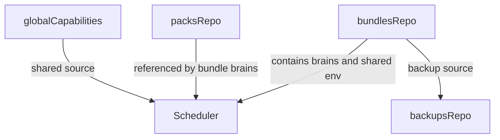

# Minecortex 分层总重构

## 最终语义

- `global`：系统级公共 capabilities 仓库，长期存在，所有 bundle 可共享，但不属于任何 bundle，也不进入 backup。
- `packs`：可复用能力定义仓库，是共享能力原料层，可被多个 bundle / brain 引用。
- `bundles`：实际运行组合层，包含：
  - bundle 内的 `brains`
  - bundle 级共享环境 / 虚拟环境 / 共享资源
  - 被该 bundle 实际持有或冻结的 pack 层能力
- `backups`：bundle 级备份，备份对象是整个 bundle 运行组合，而不是单个 brain，也不是整个 global 仓库。
- `Scheduler`：只负责 bundle 内单个 brain 的运行时装配与生命周期控制，不额外发明 brain 的 runtime 子层；`sessions`、`workspace` 等目录本身就是 runtime 状态。

## 关键纠偏

- 旧计划里“`brains/<brainId>/` 足以表征 pack/runtime”这个语义不成立。`brain` 只是实例单元，不足以承载 pack 层和共享环境的组合关系。
- `backup` 不是单 brain 快照。`backup` 备份的是一整个 bundle。
- `pack` 不等于从运行中直接导出的目录；运行中直接导出的默认语义应归入 `backup`。只有显式 `extract_pack` 才从 bundle / brain 中抽取定义文件生成新的 pack。
- `watcher` 默认不需要 watch 整个 `packs/` 仓库。未被运行态消费的 pack 变化没有热更新意义。
- `Scheduler` 保留“根据 brain 配置解析该 brain 的 source 链”是合理的，因为这是单脑装配的一部分；但它不应承担多 bundle / 多仓库编排职责。

## 两阶段实施

### 第一阶段：先搭标签机制，不大改目录

目标：先把 loader 和 selector 机制抽象对，避免文件架构重组前就被旧实现卡死。

#### 交付物

- 新的 `CapabilityDescriptor` / selector token / canonical id 体系。
- `BaseLoader` 统一承接“注册本体校验失败则安全忽略”的行为。
- `ToolLoader` / `SlotLoader` / `SubscriptionLoader` 统一消费 descriptor，而不是裸文件名。
- tags 从目录结构推导，但此阶段只要求兼容当前结构并支持第一层 tag 分类。

#### 设计要点

- selector 支持：
  - `#tag`
  - `name`
  - `name@global`
  - `name@pack:web`
  - `name@brain:coder`
- bare name 冲突时警告并跳过，不做隐式猜测。
- `discover()` 从两路径硬编码升级为 source 列表消费。
- source 优先级仍是：`brain-local > pack > global`。
- 共享基础文件统一落在不扫描目录，例如 `lib/`。

#### 这一阶段不做

- 不强推完整 `bundle` 目录改造。
- 不引入完整 backup 机制。
- 不让 watcher 扫描整个 `packs/` 仓库。

### 第二阶段：根据新语义重组文件结构

目标：把当前 brain-centric 的目录组织升级成 `global + packs + bundles + backups` 模型。

#### 目标目录模型

- `tools/<tag>/...`
- `slots/<tag>/...`
- `subscriptions/<tag>/...`
- `directives/<tag>/...`
- `skills/<tag>/...`
- `packs/<packId>/{pack.json,tools/,slots/,subscriptions/,directives/,skills/,lib/}`
- `bundles/<bundleId>/`
- `bundles/<bundleId>/brains/<brainId>/{brain.json,soul.md,sessions/,workspace/,tools/,slots/,subscriptions/,directives/,skills/,lib/,src/}`
- `bundles/<bundleId>/shared/{env/,workspace/,lib/,state/}`
- `backups/<backupId>/` 作为某个 bundle 的完整备份

#### bundle 与 brain 的关系

- `bundle` 承载共享环境、brain 集合和 pack 绑定关系。
- `brain` 是 bundle 内部单元。
- `brain.json` 仍可声明本 brain 使用哪些 pack / selectors。
- `Scheduler` 启动 brain 时，可以从 brain 配置与所在 bundle 上下文解析出有效 source 链。

#### backup 语义

- `backup` 保存的是：
  - bundle 内 brains
  - bundle 共享环境
  - bundle 实际依赖到的 pack 层能力
- `backup` 不保存 global。
- 恢复 backup 的单位是 bundle，而不是单 brain。

#### pack 语义

- `pack` 是可复用定义层，不默认等于运行态导出。
- 只有显式 `extract_pack(bundleId|brainId, packId)` 才从运行态抽取定义文件形成 pack。
- `pack` 不包含 sessions/workspace 等运行时状态。

## 管理职责

### Scheduler

- 管 bundle 内单 brain 生命周期：`create/start/stop/restart/shutdown/free`。
- 管 brain 初始化时的 source 链解析与 loader 装配。
- 不负责：
  - bundle 级 backup/restore
  - pack 仓库提取/整理
  - 多 brain / 多 bundle 编排

### 上层管理职责

不急着提前锁死类名，但语义上需要两类上层能力：

- `PackService`：pack 的定义、校验、extract、list。
- `BundleOrRuntimeManager`：bundle / backup / brains 组合编排。

这里先不强行把类名写死，等第二阶段目录真正落定后再命名，以避免现在提前命名造成误导。

## watcher 原则

- 只 watch 已进入运行态装配的目录。
- 默认不 watch 整个 `packs/` 仓库。
- 若未来支持“运行中 brain 对已引用 pack 热更新”，也应只 watch 当前运行 bundle 实际引用到的 pack 路径，而不是全量仓库。
- `watcher.ts` 仍需要修正 delete 事件语义，但这是与 pack/bundle 解耦的底层修复。

## 关键文件方向

- [minecortex/src/core/types.ts](minecortex/src/core/types.ts)
  - 定义 `CapabilityDescriptor`、selector token、限定名、`CapabilitySource`、后续 bundle/pack manifest 类型。
- [minecortex/src/loaders/base-loader.ts](minecortex/src/loaders/base-loader.ts)
  - 从两路径 discover 升级为来源链 discover，并把模块注册契约抽象统一下沉。
- [minecortex/src/loaders/tool-loader.ts](minecortex/src/loaders/tool-loader.ts)
- [minecortex/src/loaders/slot-loader.ts](minecortex/src/loaders/slot-loader.ts)
- [minecortex/src/loaders/subscription-loader.ts](minecortex/src/loaders/subscription-loader.ts)
  - 三个 loader 统一 descriptor 化。
- [minecortex/src/core/scheduler.ts](minecortex/src/core/scheduler.ts)
  - 保留单脑装配与生命周期，但去掉过早膨胀的仓库管理语义。
- [minecortex/src/fs/path-manager.ts](minecortex/src/fs/path-manager.ts)
  - 第二阶段补齐 `packs/`、`bundles/`、`backups/` 的路径语义。
- [minecortex/src/fs/watcher.ts](minecortex/src/fs/watcher.ts)
  - 修正 delete 语义，并收敛 watch 范围。
- [minecortex/AGENTIC.md](minecortex/AGENTIC.md)
  - 最后统一更新目录地图与术语。

## 推荐落地顺序

1. 先把 tags/selector/descriptor 机制做对。
2. 再抽象 loader 的 source 链与安全忽略语义。
3. 接着确定 bundle 目录模型与 backup 边界。
4. 再引入 pack / bundle 的上层管理 API。
5. 最后更新 watcher 范围和文档。

