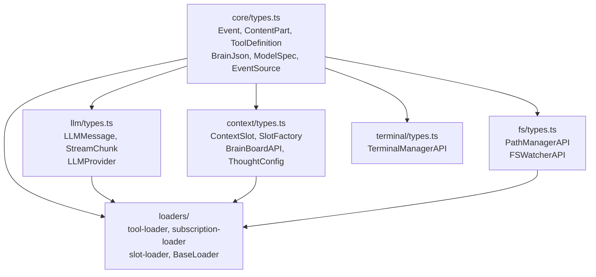

# 模块化目录结构设计 + P0 修订（v2）

## 修订说明

基于以下反馈修正 v1 方案：

- directives 和 skills **不是框架基础设施**，它们是 Slot factory 的加载目标（`slots/directives.ts`、`slots/skills.ts`），从 `src/` 中移除
- BrainBus 不是"脑间通信"——它是统一的事件路由机制，应合并到 EventBus。核心抽象是 EventQueue 的两面：trigger（push 侧）和 drain（consume 侧）
- terminal 保留在 `src/`，外部通过 `tools/bash.ts` 工具引用
- 三个 loader 各只有一个文件，统一放 `src/loaders/`

## 设计原则

- **types 按模块分布**：每个文件夹有自己的 `types.ts`，不再堆在一个文件里
- **core/types.ts 放公共原语**：被外部文件（`tools/*.ts`、`subscriptions/*.ts`）直接 import 的类型留在 core
- **模块专用类型各归其位**：LLM、Context、FS、Terminal 各自的 types.ts 放领域类型
- **loaders 集中管理**：三个对称 loader 各一个文件，共用 BaseLoader 基类，放一个目录
- **EventBus 统一路由**：消除 BrainBus，所有事件通过一个 EventBus 路由到目标 brain 的 EventQueue

## 一、src/ 整体目录结构

```
src/
├── main.ts                        # 入口
│
├── core/                          # 核心原语（最底层）
│   ├── types.ts                   #   公共类型（见下方详表）
│   ├── index.ts                   #   barrel re-export
│   ├── scheduler.ts               #   脑发现 + 生命周期 + EventBus 接线
│   ├── event-bus.ts               #   统一事件路由（合并原 BrainBus 路由逻辑）
│   ├── event-queue.ts             #   per-brain: trigger(push) + drain(consume)
│   └── brain.ts                   #   ConsciousBrain + agent loop
│
├── llm/                           # LLM 适配层
│   ├── types.ts                   #   LLMMessage, LLMResponse, StreamChunk, LLMProvider
│   ├── index.ts
│   ├── provider.ts                #   Provider 工厂 + 模型路由
│   ├── anthropic.ts
│   ├── gemini.ts
│   └── openai-compat.ts
│
├── context/                       # 上下文引擎 + Slot 系统
│   ├── types.ts                   #   ContextSlot, SlotKind, SlotFactory, ThoughtType,
│   │                              #   ThoughtConfig, BrainBoardAPI
│   ├── index.ts
│   └── context-engine.ts          #   Prompt Pipeline (Resolve→Filter→Sort→Render→Budget)
│
├── loaders/                       # 三个对称 Loader + 基类
│   ├── types.ts                   #   BaseLoader 内部类型（LoaderContext 等）
│   ├── index.ts
│   ├── base-loader.ts             #   BaseLoader 抽象基类（discover→filter→import→register→reload）
│   ├── tool-loader.ts
│   ├── subscription-loader.ts
│   └── slot-loader.ts
│
├── fs/                            # 路径管理 + 文件监听
│   ├── types.ts                   #   PathManagerAPI, FSWatcherAPI, WatchRegistration, FSChangeEvent
│   ├── index.ts
│   ├── path-manager.ts
│   └── watcher.ts
│
└── terminal/                      # 终端管理（外部通过 tools/bash.ts 引用）
    ├── types.ts                   #   TerminalInstance, TerminalManagerAPI, ExecResult
    ├── index.ts
    └── manager.ts
```

### 与当前结构的变化对比

| 当前 | 变化 | 新位置 |
|------|------|--------|
| `src/core/types.ts` (全部 40+ 类型) | 拆分到 5 个 types.ts | core + llm + context + fs + terminal |
| `src/core/brain-bus.ts` | 合并到 EventBus | `src/core/event-bus.ts`（吸收路由逻辑） |
| `src/core/event-bus.ts` | 扩展，承担路由 | `src/core/event-bus.ts` |
| `src/loaders/` (3 个 loader) | 新增 slot-loader + BaseLoader | `src/loaders/`（保持集中） |
| (不存在) `src/directives/` | **不创建** | directives 是 `slots/directives.ts` factory 的目标 |
| (不存在) `src/skills/` | **不创建** | skills 是 `slots/skills.ts` factory 的目标 |
| (新增) `src/fs/` | P0 新增 | PathManager + FSWatcher |
| (新增) `src/terminal/` | P0 新增 | Terminal 管理 |

### 不在 src/ 中的概念

以下概念 **不是框架基础设施**，不在 `src/` 中建模块：

| 概念 | 原因 | 实际位置 |
|------|------|---------|
| **directives** | 是 Slot factory 的加载目标 | `slots/directives.ts` factory 扫描 `directives/*.md` |
| **skills** | 是 Slot factory 的加载目标 | `slots/skills.ts` factory 扫描 `skills/` 目录 |
| **soul** | 是 Slot factory 的加载目标 | `slots/soul.ts` factory 读 `brains/<id>/soul.md` |

## 二、EventBus 统一设计

### 合并前（当前）

```
EventBus ──(subscription events)──→ handlers ──→ EventQueue.push()
BrainBus ──(brain-to-brain)──→ onRoute callback ──→ EventQueue.push()
```

两个独立类，最终都 push 到 EventQueue。BrainBus 是多余的间接层。

### 合并后

```
EventBus
├── register(brainId, queue)           # 注册 brain 的 EventQueue
├── emit(event, sourceBrainId?)        # 统一路由入口
│   ├── payload.to === "*"  → 广播给所有脑（排除 source）
│   ├── payload.to === id   → 点对点推到目标脑的 queue
│   └── 无 to              → 推到 source 脑自己的 queue
├── on(source, handler)                # 全局事件监听（日志/调试）
└── onAny(handler)                     # 全局事件监听
```

**Scheduler 简化**：不再创建 BrainBus，直接用 EventBus：

```typescript
const eventBus = new EventBus();

for (const brainId of brainIds) {
  const queue = new EventQueue();
  eventBus.register(brainId, queue);

  const brain = new ConsciousBrain({
    ...opts,
    eventQueue: queue,
    emit: (event) => eventBus.emit(event, brainId),
  });
}
```

**核心抽象 — EventQueue 的两面**：

- **trigger 侧** (`push`): 事件进入队列，`waitForEvent()` 唤醒脑
- **drain 侧** (`drain`): 按 priority 排序消费全部累积事件

所有事件（subscription、tool emit、脑间消息）最终都走 `EventQueue.push()` → `waitForEvent()` trigger → `drain()` consume 这条路径。

## 三、各模块 types.ts 类型分配

### `core/types.ts` — 公共原语（~20 个类型）

这些类型被 `tools/*.ts`、`subscriptions/*.ts`、`slots/*.ts` 等外部文件直接 import，必须在易于引用的位置：

```typescript
// 事件系统
export interface Event { source; type; payload; ts; priority?; silent?; steer?; }
export interface EventQueueInterface { push; drain; pending; }

// 多模态内容
export type ContentPart = { type: "text"; text } | { type: "image"; data; mimeType };
export type SerializedPart = ContentPart | { type: "image_ref"; path; mimeType };

// 模型规格
export type InputModality = "text" | "image" | "video" | "audio";
export type ReasoningEffort = "low" | "medium" | "high";
export interface ModelSpec { input; reasoning; contextWindow; maxOutput; ... }

// Brain 配置
export interface CapabilitySelector { default; enable?; disable?; config?; }
export interface BrainJson { model?; temperature?; ...; env?; session?; slots?; }
export interface MineclawConfig { defaults?: { model? }; }

// Brain 接口
export interface BrainInterface { id; run(signal); }

// 工具系统（被 tools/*.ts 直接 import）
export type ToolOutput = string | ContentPart[];
export interface ToolDefinition { name; description; input_schema; execute; }
export interface ToolContext { brainId; signal; emit; brainBoard; slot; ... }
export interface DynamicSlotAPI { register; update; release; get; }

// 事件源系统（被 subscriptions/*.ts 直接 import）
export interface SourceContext { brainId; brainDir; config?; }
export type EventSourceFactory = (ctx: SourceContext) => EventSource;
export interface EventSource { name; start(emit); stop(); }
```

**为什么这些留在 core**：`tools/send_message.ts` 写 `import type { ToolDefinition } from '../src/core/types.js'` 是自然的。如果放到 `loaders/types.ts`，工具作者要写 `import from '../src/loaders/types.js'`，语义不直觉。

### `llm/types.ts` — LLM 领域类型（~6 个类型）

```typescript
import type { ContentPart } from '../core/index.js';

export interface LLMMessage { role; content: string | ContentPart[]; thinking?; truncated?; ts?; ... }
export interface LLMToolCall { id; name; arguments; }
export interface LLMResponse { content; thinking?; rawAssistantMessage?; toolCalls?; usage?; }
export type StreamChunk =
  | { type: "text"; text: string }
  | { type: "thinking"; text: string }
  | { type: "tool_call"; id: string; name: string; arguments: string }
  | { type: "usage"; inputTokens: number; outputTokens: number };
export interface LLMProvider { chatStream(...); supportsResponseAPI?; chatResponseStream?(...); }
```

### `context/types.ts` — Slot + 上下文类型（~7 个类型）

```typescript
export type SlotKind = 'system' | 'dynamic' | 'message';
export interface ContextSlot { id; kind; order; priority; condition?; content; version; }
export type SlotFactory = (ctx: SlotContext) => ContextSlot | ContextSlot[];
export interface SlotContext { brainId; brainDir; config?; brainBoard; }
export interface ThoughtType { ... }
export interface ThoughtConfig { readOnly; tools; model; maxIterations; }
export interface BrainBoardAPI { set; get; remove; getAll; }
```

### `fs/types.ts` — 文件系统类型（~5 个类型）

```typescript
export interface PathManagerAPI { root(); dir(name); brainDir(brainId); resolve(...); checkPermission(...); }
export interface WatchRegistration { id; dispose(); }
export interface FSChangeEvent { type: "create" | "modify" | "delete"; path; isDir; }
export type FSHandler = (event: FSChangeEvent) => void | Promise<void>;
export interface FSWatcherAPI { register(pattern, handler, opts?); close(); }
```

### `terminal/types.ts` — 终端类型（~3 个类型）

```typescript
export interface TerminalInstance { id; pid; command; cwd; brainId; startedAt; exitCode?; logFile; }
export interface TerminalManagerAPI { exec; get; list; kill; readOutput; cleanup; }
export interface ExecResult { terminalId; stdout; exitCode?; backgrounded; hint?; }
```

### `loaders/types.ts` — Loader 内部类型（~2 个类型）

仅放 BaseLoader 自身的内部类型，不放 ToolDefinition / EventSource 等公共类型：

```typescript
export interface LoaderContext { brainId; brainDir; globalDir; selector: CapabilitySelector; }
```

### 类型分布总结

| 文件 | 类型数量 | 定位 |
|------|---------|------|
| `core/types.ts` | ~20 | 公共原语，被外部文件直接 import |
| `llm/types.ts` | ~6 | LLM 层专用，外部不直接 import |
| `context/types.ts` | ~7 | Slot 系统专用，slots/*.ts factory import |
| `fs/types.ts` | ~5 | 文件系统专用 |
| `terminal/types.ts` | ~3 | 终端专用，tools/bash.ts import |
| `loaders/types.ts` | ~2 | Loader 内部类型 |

### 模块依赖关系（单向，无循环）



## 四、项目根目录结构（含 slots/）

```
mineclaw/
├── AGENTIC.md
├── mineclaw.json
├── package.json / tsconfig.json
│
│── slots/                         # 全局 Slot factory (新增顶层目录)
│   ├── soul.ts                    #   读 soul.md → 1 个 system Slot
│   ├── directives.ts              #   扫描 directives/*.md → N 个 system Slot
│   ├── tools.ts                   #   工具定义列表 → 1 个 system Slot
│   ├── skills.ts                  #   扫描 skills/ → 1 个 system Slot (摘要)
│   ├── context-file.ts            #   focus 目录 AGENTS.md → 1 个 dynamic Slot
│   └── events.ts                  #   事件类型 → N 个 message Slot
│
├── subscriptions/                 # 全局 EventSource factory
│   ├── stdin.ts
│   └── heartbeat.ts
│
├── tools/                         # 全局工具实现
│   ├── send_message.ts
│   ├── read_state.ts              # (待删除，由 brain_board 替代)
│   └── (bash.ts, read_file.ts, ... 后续补全)
│
├── skills/                        # 全局技能库
├── directives/                    # 全局指令 (.md 文件)
│
├── brains/                        # 脑区 (见下方标准结构)
├── key/                           # API 密钥
├── src/                           # 框架基础设施 (见上方结构)
└── docs/
```

**tsconfig.json include 更新**：

```json
{
  "include": [
    "src/**/*.ts",
    "subscriptions/**/*.ts",
    "tools/**/*.ts",
    "slots/**/*.ts"
  ]
}
```

## 五、Brain 标准目录结构

```
brains/<id>/
├── brain.json              # [必须] 脑配置：model, subscriptions, tools, slots 选择器
├── state.json              # [必须→待删除] 工作记忆（SS7 后由 brain_board 替代）
├── soul.md                 # [有 model 时必须] 身份/人格/行为准则
│
├── src/                    # [可选] 脚本代码（默认 LLM 不可访问）
│   └── index.ts
├── tools/                  # [可选] 脑专属工具（同名覆盖全局）
├── skills/                 # [可选] 脑专属技能（同名覆盖全局）
├── subscriptions/          # [可选] 脑专属订阅源（同名覆盖全局）
├── slots/                  # [可选] 脑专属 Slot factory（同名覆盖全局）
├── directives/             # [可选] 脑专属指令 .md（被 slots/directives.ts 扫描）
├── memory/                 # [可选] 长期记忆（由记忆脑区管理，非框架机制）
├── sessions/               # [自动创建] LLM 会话历史
│   └── <sid>/
│       ├── messages.jsonl
│       ├── qa.md
│       └── medias/
└── proposals/              # [自动创建] 进化提议草稿
```

**三层能力解析**：`brain.json` CapabilitySelector → `brains/<id>/xxx/` 脑专属 → `xxx/` 全局。脑内同名覆盖全局。

**brain.json 完整字段**（含后续 Plan 新增）：

```jsonc
{
  "model": "gemini-3.1-pro",              // 或 string[]（fallback 链）
  "temperature": 0.5,
  "maxTokens": 8192,
  "reasoningEffort": "high",
  "coalesceMs": 500,
  "subscriptions": { "default": "none", "enable": ["stdin"] },
  "tools":         { "default": "all" },
  "slots":         { "default": "all" },
  "session":       { "keepToolResults": 5, "keepMedias": -1 },
  "env":           { "VIRTUAL_ENV": "./venv" }
}
```

## 六、P0 修订要点

P0 从"重写 `src/core/types.ts`"变为"建立模块化类型体系"：

1. **创建 6 个模块骨架**：core/ llm/ context/ loaders/ fs/ terminal/，每个含 types.ts + index.ts
2. **core/types.ts 保留公共原语**（~20 个），不再承载全部类型
3. **各模块 types.ts 定义领域类型**：LLM、Slot、FS、Terminal
4. **合并 BrainBus → EventBus**：统一事件路由，删除 brain-bus.ts
5. **重构 loaders/**：新增 slot-loader + BaseLoader 基类，directive-loader 被 slot-loader 替代
6. **新增 `slots/` 顶层目录**：放全局 Slot factory 文件
7. **删除旧类型**：ToolParameter、DirectiveConfig、DirectiveContext、LoadedDirective
8. **更新 tsconfig.json**：include 新增 `slots/**/*.ts`

## 七、与调研文档的对齐

| 调研结论 | 本方案的对应 |
|---------|------------|
| directives 统一为 slots/directives.ts factory | `src/` 无 directives 模块，`slots/directives.ts` 是 factory |
| 三个 Loader 对称设计 | `src/loaders/` 统一管理 tool/subscription/slot loader |
| Event 是唯一信号原语 | EventBus 统一路由，消除 BrainBus 独立类 |
| Slot 系统替代独立 loader | slot-loader 一个 loader 管理所有 Slot factory |
| 工具级动态 Slot | DynamicSlotAPI 定义在 core/types.ts（ToolContext 引用） |
