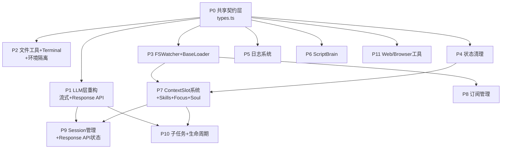

# MineClaw 并行实施计划索引

> 共 12 个 Plan (P0-P11)，分 4 个阶段执行。
> P0 是前置契约层，P1-P6+P11 可完全并行，P7-P8 等待 P3，P9-P10 等待 P1+P7。

## 执行依赖图

## 阶段总览

| 阶段 | Plans | 并行度 | 说明 |
|------|-------|--------|------|
| Phase 0 | P0 | 1 | 前置：定义所有共享接口契约 |
| Phase 1 | P1, P2, P3, P4, P5, P6, P11 | 7 | 核心：全部可并行，互不依赖 |
| Phase 2 | P7, P8 | 2 | Slot+订阅：等待 P3(+P4)完成 |
| Phase 3 | P9, P10 | 2 | 高阶：等待 P1+P7 完成 |

## Plan 列表

| 顺序 | ID | 名称 | 文件 | 依赖 |
|------|-----|------|------|------|
| 0 | P0 | 共享契约层 | [P0-shared-contracts.plan.md](P0-shared-contracts.plan.md) | 无 |
| 1 | P1 | LLM 层重构 (流式+Response API) | [P1-llm-layer.plan.md](P1-llm-layer.plan.md) | P0 |
| 2 | P2 | 文件工具 + PathManager + Terminal + 环境隔离 | [P2-file-tools.plan.md](P2-file-tools.plan.md) | P0 |
| 3 | P3 | FSWatcher(纯注册式) + BaseLoader | [P3-fswatcher-baseloader.plan.md](P3-fswatcher-baseloader.plan.md) | P0 |
| 4 | P4 | 状态清理 + brain_board | [P4-state-cleanup.plan.md](P4-state-cleanup.plan.md) | P0 |
| 5 | P5 | 日志系统 | [P5-logging.plan.md](P5-logging.plan.md) | P0 |
| 6 | P6 | ScriptBrain | [P6-script-brain.plan.md](P6-script-brain.plan.md) | P0 |
| 7 | P7 | ContextSlot + Skills + Focus + Soul | [P7-context-slot.plan.md](P7-context-slot.plan.md) | P3, P4 |
| 8 | P8 | 订阅管理 | [P8-subscription-mgmt.plan.md](P8-subscription-mgmt.plan.md) | P3 |
| 9 | P9 | Session 管理 + Response API 状态 | [P9-session.plan.md](P9-session.plan.md) | P1, P7 |
| 10 | P10 | Agent 子任务 + 生命周期 | [P10-agent-lifecycle.plan.md](P10-agent-lifecycle.plan.md) | P1, P7 |
| 11 | P11 | Web/Browser 工具 | [P11-web-tools.plan.md](P11-web-tools.plan.md) | P0 |

## 耦合点与规范

| 耦合点 | 涉及 Plans | 约定 |
|--------|-----------|------|
| `types.ts` 所有接口 | ALL | P0 统一定义，后续不可单方面修改 |
| `ToolDefinition.input_schema` | P2,P7,P8,P9,P10,P11 | JSON Schema 直连，零转换 |
| `ToolContext` 接口 | P2,P4,P7,P8,P10,P11 | P0 定义形状，各 Plan 实现对应功能 |
| `LLMProvider.chatStream` | P1,P9,P10 | P1 实现，P10 用 AbortSignal 中断 |
| `LLMProvider.chatResponseStream?` | P1,P9 | P1 实现(可选)，P9 管理 lastResponseId 存储 + 降级逻辑 |
| `llm_key.json + models.json` | P1 | 双文件架构保留不变，api type 重载机制区分 adapter |
| `BaseLoader` 基类 | P3,P7 | P3 实现，P7 的 slot-loader 继承 |
| `FSWatcher` 注册 | P3,P7,P8 | P3 实现，P7/P8 注册路径 handler |
| `BrainBoardAPI` | P4,P2,P7,P8,P10 | P4 实现，通过各种 Context 传递 |
| `PathManagerAPI` | P2,P3,P5,P7 | P2 实现，所有路径解析通过它，不硬编码 |
| `TerminalManagerAPI` | P2,P5 | P2 实现，通过 PathManager.dir("terminals") 定位日志目录 |
| `FSWatcherAPI` | P3,P7,P8 | P3 实现纯注册式 API，消费方自行 register watch patterns |
| `brain.ts process()` | P4,P5,P7,P9,P10 | 按 P4→P5→P7→P9→P10 顺序集成 |
| `scheduler.ts` | P3,P4,P6,P10 | P3(FSWatcher) P4(Board) P6(分支) P10(shutdown) |

## 扩展模块（核心完成后按需）

- Browser 工具完整实现 — P11 后期扩展
- Memory brain 模式 — 设计模式（不是框架机制），用 brain + subscription 自建
